# 🚀 [심화 풀코스] LG Electronics · Gemini Enterprise & Antigravity 2.0 실무 마스터 가이드 (Advanced 3H Edition)

> <strong>Step-by-Step 심화 실습 가이드 (3시간 풀코스 · Antigravity 2.0 신기능 & 파워 팁 총망라)</strong>  
> 기본 기능 습득을 넘어, <strong>AI 이미지·배너 직접 생성(`generate_image`) · 캡처 화면 1분 복제(`Vision-to-Code`) · 오디오 팟캐스트 브리핑 · 채팅창 인라인 환율 계산기 앱(`Generative UI`) · `/plugin` 통합 패키징 · 자율 완주(`/goal`) · 4대 계열사 라이브 멀티 티커 · 920행 파이썬 정제 · 수익성 히트맵 · 3축 What-if 시뮬레이터 · 원클릭 임원 보고서 추출기</strong>까지 현업 최신 기능을 모두 경험합니다.

---

## 🗺️ 0. 오늘 함께 완성할 6단계 심화 누적 빌드업 & 신기능 로드맵 (총 3시간 풀코스)

<strong>1부(크롬 웹, 1시간)</strong>에서는 주간 트렌드 브리핑과 CFO 리스크 반론 스킬을 교차 실행하고, <strong>Imagen 광고 시안 생성 · Deep Research · Audio Overview(음성 팟캐스트)</strong>까지 체험한 뒤 조건부 승인 워크플로우로 지메일 임시보관함에 자동 저장합니다. <strong>2부(Antigravity 앱, 2시간)</strong>에서는 단일 웹페이지(`index.html`)에 <strong>[탭 1: AI 생성 화보 배너 & 웹 슬라이드] ➔ [탭 2: 4대 계열사 주가·신호등 뉴스·캡처 복제] ➔ [탭 3: 920행 정제 차트·히트맵·What-if 시뮬레이터] ➔ [탭 4: 원클릭 임원 보고서 추출기]</strong>를 차례대로 누적 탑재하고, <strong>파워 팁 총정리 리뷰 & 환율 계산기 앱 · `/plugin` 실습</strong>으로 마무리합니다.

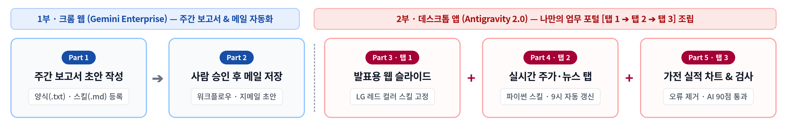

| 파트 (시간) | 실습 환경 | 내가 직접 만드는 심화 누적 산출물 & 핵심 신기능 |
| :--- | :---: | :--- |
| <strong>Part 1 (30분)</strong> | 🌐 크롬 GE Web | <strong>`Knowledge` 보고서 + `/lg-executive-briefing` & `/lg-cfo-risk-review` 연쇄 호출 + `Imagen` 화보 & `Audio Overview` 팟캐스트</strong> |
| <strong>Part 2 (25분)</strong> | 🌐 크롬 GE Web | <strong>`HITL Approval` + `Flow control (If/else)` 조건부 라우팅 + `Rejected` 반려 루프 기반 Gmail 자동 초안</strong> |
| <strong>Part 3 (30분)</strong> | 💻 Antigravity 2.0 | <strong>LG 브랜드(`#A50034`) 슬라이드 + 전력 시뮬레이터 & Q&A 드로어 + 🎨 내장 `AI 이미지 생성 & 다크 홀로그램 편집`</strong> |
| <strong>Part 4 (35분)</strong> | 💻 Antigravity 2.0 | <strong>4대 계열사 멀티 주가 티커 + 신호등 AI 뉴스 + `KRW⇄USD` 환산 바 + 📸 `화면 캡처 복제(Vision)` & 💬 `인라인 위젯`</strong> |
| <strong>Part 5 (40분)</strong> | 💻 Antigravity 2.0 | <strong>파이썬 데이터 정제(`920행`) + 수익성 히트맵·이상탐지 + 3축 What-if 슬라이더 + `탭 4: 보고서 추출기(.md/.csv)` + `90점 감사`</strong> |
| <strong>Part 6 (20분)</strong> | 💻 Antigravity 2.0 | <strong>🎁 [파워 팁 리뷰 & 미니 실습] `/` 명령어 · `@conversation` · `@rule` 총정리 + 💱 `generative_ui` 환율 계산기 앱 + 🧩 `Customizations` Google Workspace 연동 & `/plugin` + `/goal` · `/btw`</strong> |

---

## 📦 실습 전 준비: 실습 파일 한 번에 다운로드 (`LG_Workshop_Files.zip`)

> <strong>📥 번거롭게 하나씩 받지 마세요!</strong> 아래 버튼을 누르면 오늘 실습에 쓰이는 <strong>6개 파일 전체가 압축된 `LG_Workshop_Files.zip`</strong>이 내 PC로 즉시 다운로드됩니다. 다운로드 후 압축을 풀어 작업 폴더(예: `lg-work-portal`)에 넣어두세요.
>
> 👉 <a href="./LG_Workshop_Files.zip" download="LG_Workshop_Files.zip"><strong>[📥 실습 파일 6종 전체 ZIP 한 번에 다운로드 (LG_Workshop_Files.zip)]</strong></a>

<details class="file-list-details">
<summary><strong>📂 개별 실습 파일 6종 상세 설명 및 개별 다운로드 보기 (클릭하여 펼치기)</strong></summary>

| 번호 | 파일명 (클릭 시 열기) | 사용 파트 | 파일 역할 및 핵심 내용 |
| :---: | :--- | :---: | :--- |
| <strong>01-A</strong> | [`01_GE_Workflow_lg_weekly_report_template.txt`](./files/01_GE_Workflow_lg_weekly_report_template.txt) | <strong>Part 1</strong> | 크롬 GE `Project Knowledge`에 업로드할 <strong>사내 주간 트렌드 보고서 표준 서식 (`.txt`)</strong> |
| <strong>01-B</strong> | [`01_GE_Skill_lg_executive_briefing_SKILL.md`](./files/01_GE_Skill_lg_executive_briefing_SKILL.md) | <strong>Part 1</strong> | 크롬 GE `Skills` ➔ `Upload skill`에 업로드해 `/lg-executive-briefing`으로 호출하는 <strong>임원 브리핑 스킬 (`.md`)</strong> |
| <strong>01-C</strong> | [`01_GE_Workflow_lg_weekly_report_template.md`](./files/01_GE_Workflow_lg_weekly_report_template.md) | <strong>Part 2</strong> | 크롬 GE `Workflow` 노드의 `Files`에 첨부파일로 넣을 <strong>사내 주간 트렌드 보고서 마크다운 템플릿 (`.md`)</strong> |
| <strong>02</strong> | [`02_AG_Webpage_lg_brand_slides_SKILL.md`](./files/02_AG_Webpage_lg_brand_slides_SKILL.md) | <strong>Part 3</strong> | 매번 랜덤으로 나오는 슬라이드 색감을 <strong>LG 시그니처 레드(`#A50034`) + 화이트 배경</strong>으로 고정하는 스킬 |
| <strong>03</strong> | [`03_AG_Dashboard_fetch_lg_live_market.py`](./files/03_AG_Dashboard_fetch_lg_live_market.py) | <strong>Part 4</strong> | LG전자(`066570`) 현재가·환율·구글 뉴스 실시간 수집 코드 |
| <strong>04</strong> | [`04_AG_Analytics_lg_appliance_data.csv`](./files/04_AG_Analytics_lg_appliance_data.csv) | <strong>Part 5</strong> | 5대 가전(`OLED evo`·`워시타워`·`디오스`·`HVAC`·`스탠바이미`) <strong>920행 실적·구독·ThinQ 데이터</strong> |

</details>

---

# 🌐 [1부 · 크롬 브라우저] Part 1. GE - Project · 멀티 Skill 체이닝 & Imagen·오디오 브리핑
### 🔹 Step 1-1. 새 프로젝트(`Project`) 생성 및 팀원 공유하기

> <strong>🎯 핵심 포인트:</strong> 팀 전용 <strong>`Project`</strong>를 만들고 팀원을 초대하면, 내가 올린 보고서 양식을 팀원 모두가 똑같이 쓸 수 있습니다.

1. 크롬에서 <strong>Gemini Enterprise</strong> 접속 ➔ 좌측 메뉴 <strong>`Projects` ➔ `[+ New Project]`</strong> 클릭
2. 프로젝트 이름(예: `LG` 또는 `LG-Market-Trends`)과 간단한 <strong>`Description`(설명)</strong>을 적당히 입력하고, 우측 상단 <strong>`Invite+`</strong> 버튼을 눌러 팀원 이메일 추가 (권한: <strong>`Editor`</strong>)
3. 좌측 사이드바 <strong>`Team`</strong> 메뉴에서 초대된 팀원이 정상 추가되었는지 확인

👉 **화면 확인 포인트:** (`우측 상단 Invite 버튼 & 좌측 Knowledge / Team 메뉴`)
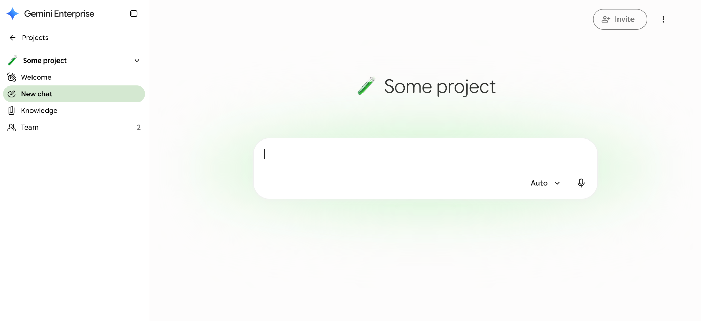

---

### 🔹 Step 1-2. 프로젝트 `Knowledge`(양식 파일) 등록 & 주간 트렌드 보고서 생성

> <strong>🎯 핵심 포인트:</strong> <strong>`Knowledge`</strong>에 보고서 양식 파일(`.txt`)을 한 번만 올려두면, 매번 길게 지시하지 않아도 알아서 회사 양식대로 보고서를 써줍니다.

1. 좌측 사이드바 <strong>`Knowledge`</strong> 메뉴 ➔ 우측 <strong>`Upload` (`Add`)</strong> 클릭 ➔ <strong>`Upload files`</strong>에서 실습 파일 <strong>[`01_GE_Workflow_lg_weekly_report_template.txt`](./files/01_GE_Workflow_lg_weekly_report_template.txt)</strong>를 추가하고 <strong>`Description`(설명)</strong>도 적당히 입력해 저장 *(또는 `Paste text`로 내용 붙여넣기)*
2. 업로드가 완료되면 <strong>`New chat`</strong>을 눌러 아래 프롬프트를 그대로 복사해 입력합니다:

```text
최근 1개월간 LG 전자 프리미엄 시장 트렌드를 조사해서 프로젝트 Knowledge에 등록된 주간 트렌드 보고서 템플릿 양식으로 출력해줘
```

👉 **실행 결과 화면:** (`01_GE_Workflow_lg_weekly_report_template.txt` 서식이 자동 반영된 보고서)
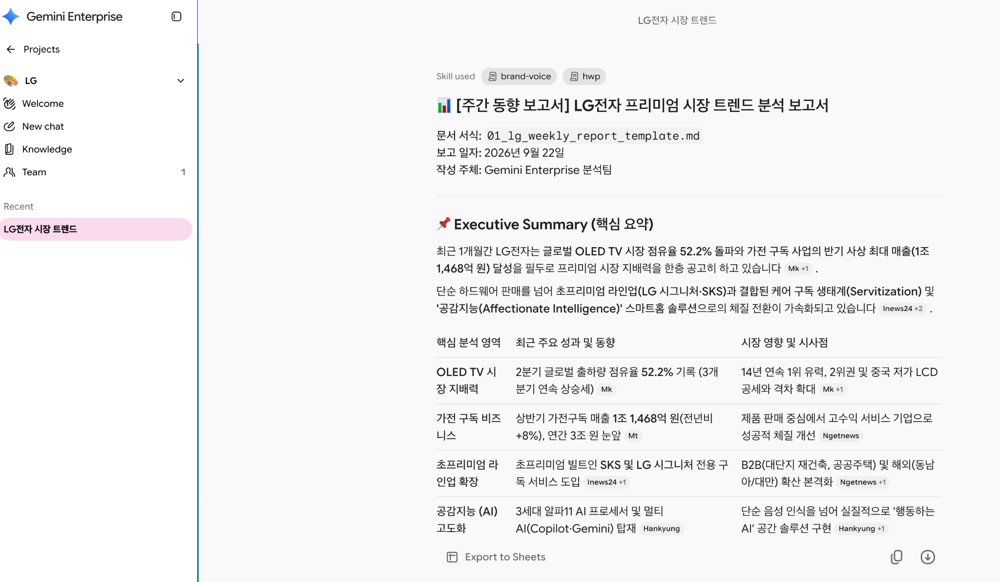

---

### 🔹 Step 1-3. [GE Skill 실습] `.md` 파일 업로드로 나만의 Skill 설치 & `/lg-executive-briefing` 호출하기

> <strong>🎯 `Knowledge` vs `Skills` 한 줄 차이:</strong>  
> * <strong>`Knowledge`</strong>: 이 프로젝트 안에서만 참고하는 배경 자료  
> * <strong>`Skills`</strong>: 내 계정에 설치해 두고 <strong>어느 채팅창에서든 `/스킬이름` 한 줄로 바로 불러 쓰는 나만의 단축키</strong>

<details class="file-list-details">
<summary><strong>📄 (참고) 실습 스킬 파일 내용 미리보기 (`01_GE_Skill_lg_executive_briefing_SKILL.md` — 클릭하여 펼치기)</strong></summary>

```markdown
---
name: lg-executive-briefing
description: "LG전자 가전 및 TV 시장 뉴스를 임원 보고용 3줄 핵심 요약, 당사 vs 경쟁사 비교표, 출처 검증 포맷으로 즉시 변환하는 스킬"
---

# LG전자 임원 보고용 시장 트렌드 브리핑 스킬 (lg-executive-briefing)

사용자가 제품군이나 시장 트렌드 주제를 입력하면, 항상 아래 3단 표준 구조로만 간결하고 명확하게 보고서를 작성하세요.

## 1. 📌 [Executive Summary] 경영진 3줄 핵심 요약
- 결론부터 두괄식으로 3줄 이내로 핵심 시장 변화와 당사 시사점을 요약합니다.
- 모든 제품명은 'LG 올레드 에보(LG OLED evo)', 'LG 워시타워(WashTower)'처럼 국문과 영문을 첫 등장 시 병기합니다.

## 2. 📊 당사 vs 주요 경쟁사 핵심 트렌드 비교표
반드시 아래 마크다운 표 컬럼을 유지하여 작성하세요:
| 제품군 | 글로벌 시장 핵심 동향 (수치 포함) | 주요 경쟁사 동향 | LG전자 차별화 포인트 및 전략 | 인라인 출처 ([매체명, 날짜]) |

## 3. 💡 실무 액션 아이템 (Next Steps)
- 현업 부서(상품기획·마케팅·영업)에서 즉시 검토해야 할 후속 조치 2가지를 체크리스트(`- [ ]`) 형태로 제시합니다.
```

</details>

#### 1️⃣ `Skills` ➔ `+ (Add skill)` ➔ `Upload skill`에서 `.md` 파일 업로드하기
1. 좌측 메뉴에서 <strong>`📄 Skills`</strong>를 클릭합니다.
2. 상단 <strong>`+` (`Add skill`)</strong> 버튼(또는 초기 화면의 `Upload skill` 버튼)을 누르고 메뉴에서 <strong>`⬆️ Upload skill`</strong>을 선택합니다.
3. **`Import skill`** 팝업창(`Supports .md and .zip files`)에서 **`Browse files`**를 눌러 실습 파일 <strong>[`01_GE_Skill_lg_executive_briefing_SKILL.md`](./files/01_GE_Skill_lg_executive_briefing_SKILL.md)</strong>를 선택한 뒤 파란색 <strong>`Import`</strong> 버튼을 클릭합니다.


#### 2️⃣ 설치된 `lg-executive-briefing` 스킬 확인 & `New chat` 클릭
* 업로드 즉시 좌측 `Enabled` 목록에 <strong>`📄 lg-executive-briefing`</strong>이 등록되고 트리거 명령어(<strong>`/lg-executive-briefing`</strong>)가 생성됩니다. 우측 상단의 파란색 <strong>`✏️ New chat`</strong> 버튼을 클릭합니다.

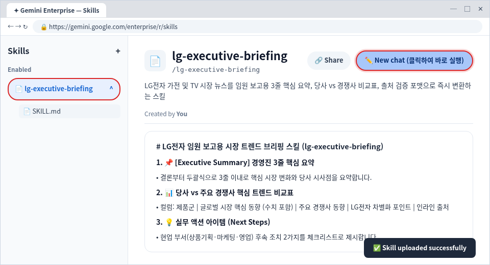

#### 3️⃣ 채팅창에서 `/lg-executive-briefing` 스킬 칩으로 1줄 브리핑 실행하기
* 채팅 입력창에 **`/lg-executive-briefing`** 칩이 자동 삽입된 상태에서(또는 일반 채팅창에서 `/`를 쳐서 스킬 선택 후), 아래 한 줄만 입력해 실행합니다:

```text
/lg-executive-briefing 북미 프리미엄 OLED TV 및 AI 워시타워 최근 시장 트렌드 브리핑해줘.
```

👉 **실행 결과 화면:** (긴 양식 설명 없이도 스킬에 정의된 `[1. 경영진 3줄 요약 ➔ 2. 당사 vs 경쟁사 비교표 ➔ 3. 실무 액션 아이템]` 3단 구조로 즉시 출력!)
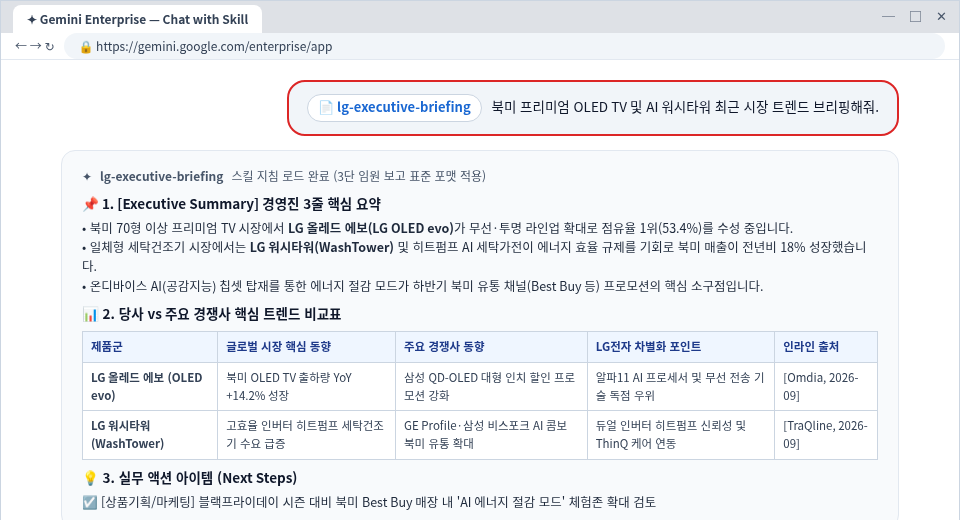

---

### 🔹 Step 1-4. [심화] 2번째 감사 스킬(`/lg-cfo-risk-review`) 직접 생성 & 멀티 스킬 교차 검증하기

> <strong>🎯 핵심 포인트:</strong> 현업에서는 '장밋빛 시장 기회'만 보고하면 임원진에게 반드시 <strong>"원가·관세·수익성 리스크는 뭔가?"</strong>라는 역질문을 받습니다. <strong>CFO(최고재무책임자) 관점의 반론 스킬</strong>을 하나 더 만들어 같은 대화방에서 연달아 호출(Skill Chaining)해 봅니다.

#### 1️⃣ `Skills` ➔ `+ (Add skill)` ➔ `Create skill`로 2번째 스킬 직접 만들기
1. 좌측 메뉴 <strong>`📄 Skills` ➔ `+` (`Add skill`) ➔ `✏️ Create skill`</strong>(또는 메모장으로 `.md` 파일 수정 후 `Upload skill`)을 클릭합니다.
2. 스킬 이름에 **`lg-cfo-risk-review`**, 설명에 **`"사업 보고서의 낙관적 전망에 대해 CFO 관점에서 관세·물류비·수익성 리스크와 방어 시나리오를 표로 검증하는 스킬"`**을 입력하고 본문 지침에 아래 내용을 붙여넣어 저장합니다:

```text
사용자가 지정한 보고서나 시장 트렌드 내용에 대해 반드시 아래 2가지 항목으로만 날카롭게 반론 및 리스크를 진단하세요:
1. ⚠️ [CFO 핵심 리스크 점검표]: | 리스크 영역(관세·물류·패널원가·환율) | 최악 시나리오(Worst Case) | 영업이익 영향도(상/중/하) | 재무·공급망 방어 대책 |
2. 🎤 [경영진 회의 예상 압박 질문 2선]: 임원 보고 시 반드시 나올 날카로운 수익성 질문 2개와 수치 기반 모범 답변을 제시하세요.
```

#### 2️⃣ 방금 브리핑한 채팅창에서 `/lg-cfo-risk-review` 연달아 호출해 교차 검증하기
* Step 1-3에서 북미 OLED TV·워시타워 트렌드를 출력했던 채팅창으로 돌아와, **`/lg-cfo-risk-review`를 타이핑 후 `[Tab]` 키**로 선택하고 아래 문장을 붙여넣습니다:

```text
/lg-cfo-risk-review 위 북미 OLED TV 및 AI 워시타워 보고서에 대해 CFO 관점에서 관세·물류·수익성 리스크와 방어 대책을 냉정하게 점검해줘.
```

---

### 🔹 Step 1-5. [GE 신기능 체험] 크롬 GE에서 `Imagen 광고 화보 생성` · `Deep Research` & `Audio Overview(음성 팟캐스트)` 체험하기

> <strong>🎯 핵심 포인트 (현장 호응도 1위 신기능!):</strong> 크롬 Gemini Enterprise에서는 텍스트 보고서뿐 아니라 <strong>① 마케팅 프로모션 화보 이미지(Imagen) 즉시 생성</strong>, <strong>② 수십 개 글로벌 사이트를 자동 탐색하는 심층 리서치(`Deep Research`)</strong>, <strong>③ 보고서를 2명의 AI 진행자가 대화하는 라디오 방송으로 바꿔주는 음성 브리핑(`Audio Overview`)</strong>을 바로 쓸 수 있습니다.

#### 1️⃣ [Imagen 마케팅 시안 생성] 채팅창에서 LG 가전 프로모션 화보 시안 즉시 그리기
크롬 GE 채팅창에 아래 프롬프트를 입력해 마케팅/기획안 첨부용 고화질 컨셉 이미지를 바로 생성해 봅니다:

```text
유럽 밀라노 스타일의 모던한 거실과 주방에 놓인 차세대 LG OLED evo TV와 AI 워시타워 프리미엄 프로모션 화보 이미지를 16:9 비율로 그려줘.
```

#### 2️⃣ [Deep Research & Audio Overview] 심층 리서치 가동 & 2인 진행자 라디오 팟캐스트 들어보기
1. **Deep Research (심층 리서치)**: 채팅 입력창 하단 도구에서 **`Deep Research`**를 선택(또는 리서치 에이전트 호출)하면, 에이전트가 스스로 조사 계획(`Research Plan`)을 세우고 수십 개의 글로벌 가전 매체·리포트를 교차 탐색해 심층 보고서를 작성합니다.
2. **Audio Overview (음성 팟캐스트 변환)**: 생성된 보고서나 문서 상단/하단의 **`🎧 Audio Overview` (음성 개요 생성)** 버튼을 누르면, 2명의 AI 호스트가 출연해 오늘 작성한 LG 가전 트렌드 보고서의 핵심 포인트를 라디오 토크쇼처럼 생생하게 브리핑해 줍니다!

---

# ⚡ [1부 · 크롬 브라우저] Part 2. GE Workflow & 조건부 라우팅 자동화
### 🔹 Step 2-0. [필수] 실습 시작 전 Gmail 연동(Authorize) 1회 사전 승인하기

> <strong>⚠️ Workflow 실행 전 필수 점검:</strong>  
> 이번 파트에서는 워크플로우 마지막 단계에서 사람이 최종 승인한 보고서를 <strong>내 Gmail 임시보관함(`Drafts`)에 자동으로 생성</strong>합니다.  
> 노드를 다 만든 후 `Test` 실행 중에 권한 팝업 차단이나 연동 오류가 발생하지 않도록, <strong>본격적인 워크플로우 조립 전 Gmail 앱 권한(OAuth)을 미리 1회 연동(Authorize)</strong>해 둡니다.

1. 크롬에서 **Gemini Enterprise** 좌측 메뉴 **`New Agent` ➔ `Workflow`** 진입 후 우측 패널의 **`연결된 앱` (Connected apps)** 확인
2. 목록에서 **`Gmail`** 우측의 **`작업 사용 설정` (또는 `[Connect]`)** 링크를 클릭합니다.
3. 화면에 뜨는 **`로그인 - Google 계정 (계정을 선택하세요. Gemini Enterprise(으)로 이동)`** 팝업창에서 내 계정을 선택하고 **`Allow`(허용)**를 눌러 권한을 1회 승인합니다.
4. 사전 연동이 완료되었다면 아래 **Step 2-1**로 이동하여 5단계 자동화 파이프라인을 본격적으로 조립합니다!

👉 **사전 권한 승인 화면:** (`우측 연결된 앱 > Gmail [작업 사용 설정] 클릭 ➔ Google 계정 로그인 팝업 Allow 승인`)
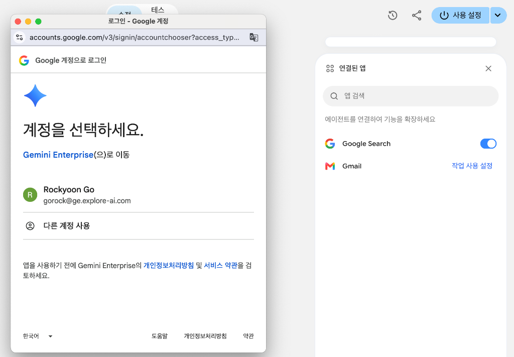

---

### 🔹 Step 2-1. 트렌드 조사 + 양식 포맷팅(`.md` 첨부) + 사람 승인(`Approval`)을 Workflow로 연결하기

> <strong>🎯 핵심 포인트:</strong> <strong>[뉴스 검색 ➔ 보고서 양식 변환 ➔ 사람 승인 ➔ 지메일 저장]</strong>을 한 번에 이어주는 자동화 파이프라인입니다. 앞 단계 결과를 빠짐없이 넘겨주기 위해 출력 변수(`content`) 하나로 연결합니다.

* **전체 연결 흐름 (5단계 노드)**:
  - <strong>`Manual` (시작 트리거)</strong> ➔ <strong>`Gemini Agent` (트렌드 뉴스 수집 · `content` 출력)</strong> ➔ <strong>`Gemini Agent 1` (`01_GE_Workflow_lg_weekly_report_template.md` 첨부 양식 포맷팅 · `content` 출력)</strong> ➔ <strong>`Approval` (사람의 개입 HITL)</strong> ➔ <strong>`Gemini Agent 2` (Gmail 드래프트 생성)</strong>

---

#### 0️⃣ 워크플로우 생성 시작 — `Build manually` (수동 빌더 진입)
1. 좌측 메뉴에서 <strong>`New Agent` ➔ `Workflow`</strong>를 클릭합니다.
2. **"Let's build your workflow"** 시작 화면 우측 하단의 <strong>`🔧 Build manually`</strong> 버튼을 클릭해 캔버스 편집기를 엽니다.


---

#### ① `1. Manual` — 시작 트리거 노드 확인
* **루트 트리거 확인**: 캔버스 상단에 기본 생성된 <strong>`1 Manual`</strong> 노드를 클릭하고 우측 패널의 `Trigger type`이 <strong>`Manual`</strong>(수동 실행)로 되어 있는지 확인합니다. *(별도의 `Input fields`는 추가하지 않습니다.)*

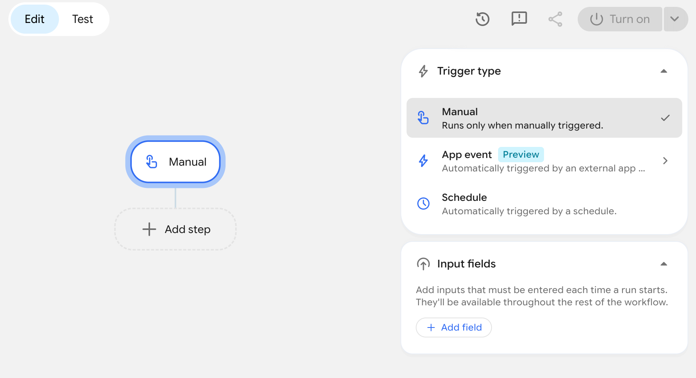

---

#### ② `2. Gemini Agent` — 1단계: 트렌드 뉴스 수집 & `Structured output`(`content`) 설정
1. **노드 추가 및 프롬프트 입력**: `Manual` 노드 아래 <strong>`+ Add step`</strong> 클릭 ➔ 첫 번째 <strong>`Gemini Agent`</strong>를 추가합니다. 우측 패널 <strong>`Connected apps`</strong>에 <strong>`Google Search` (G 아이콘)</strong>가 켜져 있는지 확인하고, <strong>`Instructions`</strong> 칸에 아래 프롬프트를 입력합니다:

```text
최근 1개월간 LG전자 핵심 AI 가전(OLED evo, 워시타워, HVAC) 및 경쟁사 시장 트렌드 뉴스를 조사해서 핵심 요약, 주요 동향·수치, 출처([매체명, 날짜])를 핵심 위주로 간결하게 정리해줘.
```

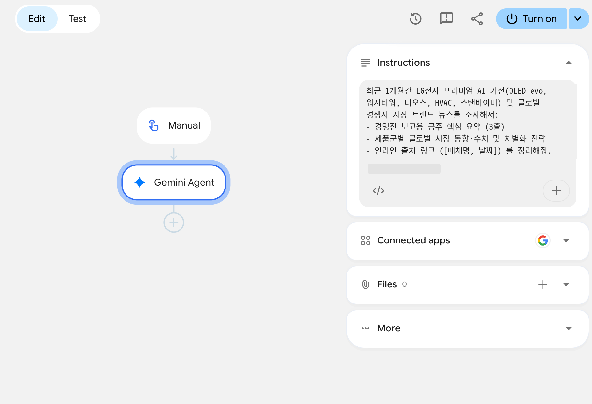

2. **`More` ➔ `Output`을 `Structured output`으로 변경**: 우측 패널 맨 아래 <strong>`More`</strong>를 클릭해 펼친 뒤, <strong>`Output`</strong> 드롭다운(`Plain text`)을 눌러 <strong>`Structured output` (정형화된 서식 출력)</strong>을 선택합니다.

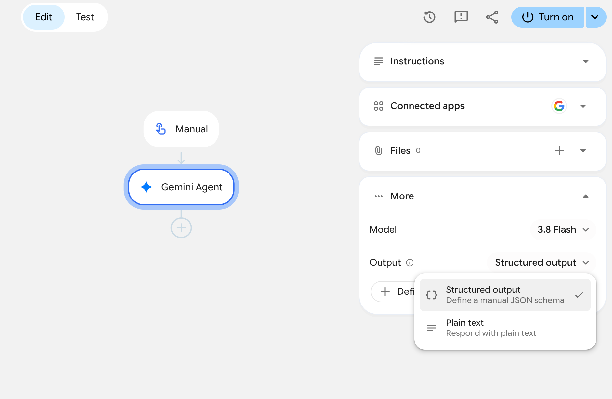

3. **`Output Format`에 `content` (`Text`) 단일 변수 등록**: <strong>`+ Define output schema` (출력 변수 정의)</strong>를 클릭해 팝업창을 열고, 필드명 <strong>`content`</strong> (타입: <strong>`Text`</strong>)를 입력한 뒤 우측 하단 <strong>`Apply Schema`</strong>를 클릭합니다. (설정이 완료되면 우측 패널 Output 아래에 `= content` 칩이 표시됩니다.)

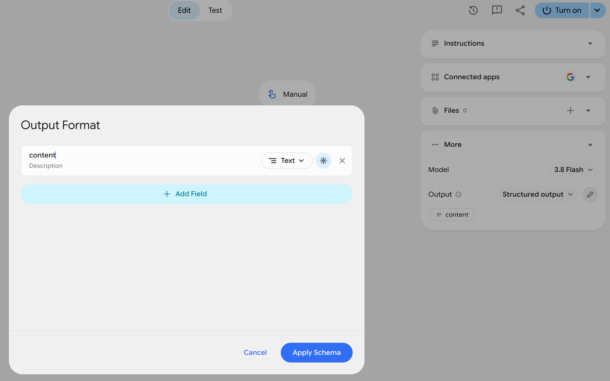

---

#### ③ `3. Gemini Agent 1` — 2단계: `01_GE_Workflow_lg_weekly_report_template.md` 양식 첨부 & `content` 변수 전달
1. **이전 단계 `content` 변수 불러오기 (`+` ➔ `{} Variables`)**: 첫 번째 `Gemini Agent` 아래 <strong>`+ Add step`</strong>을 눌러 두 번째 에이전트(<strong>`Gemini Agent 1`</strong>)를 추가합니다. 우측 <strong>`Instructions`</strong> 입력창 우측 하단의 <strong>`+` 아이콘</strong>을 클릭하고 <strong>`{} Variables`</strong>를 선택합니다.

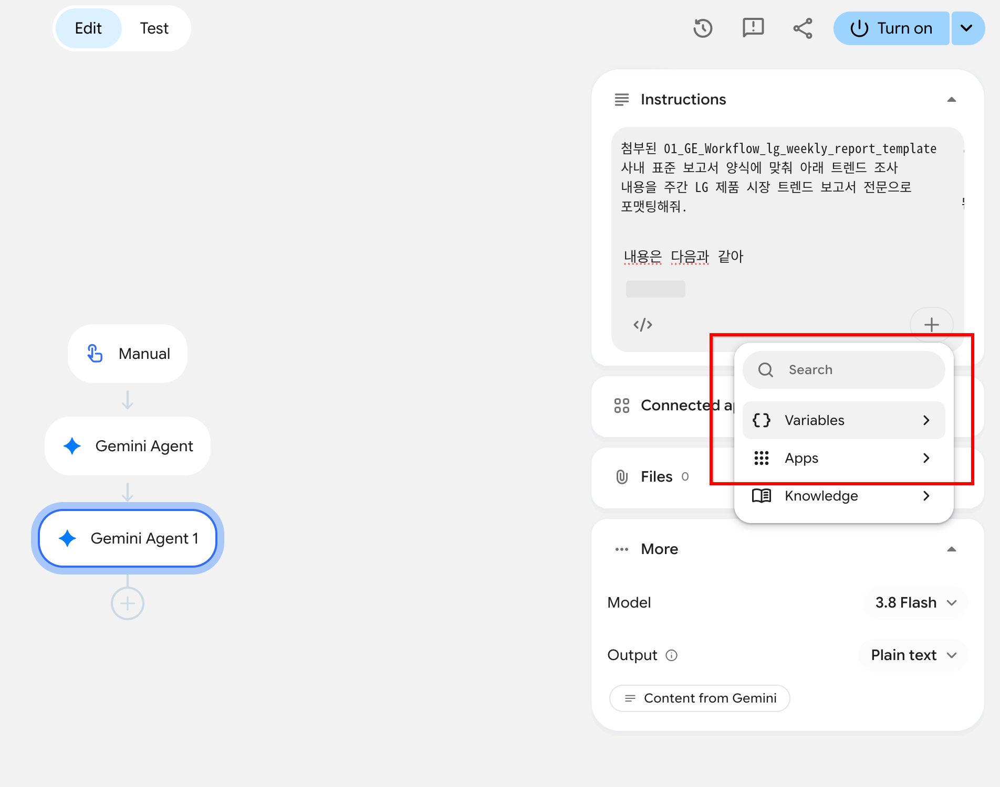

2. **`2 ✨ Gemini Agent: content` 클릭 및 지시문 작성**: 변수 목록에서 앞 단계의 출력 변수인 <strong>`2 ✨ Gemini Agent: content` (`Text`)</strong>를 클릭해 삽입하고, 아래와 같이 첨부된 `.md` 템플릿 파일로 변환하는 프롬프트를 작성합니다:

```text
Gemini Agent: content
첨부된 사내 표준 보고서 양식(01_GE_Workflow_lg_weekly_report_template.md)에 맞춰 위 트렌드 조사 내용을 주간 LG 제품 시장 트렌드 보고서 전문으로 포맷팅해줘.
```

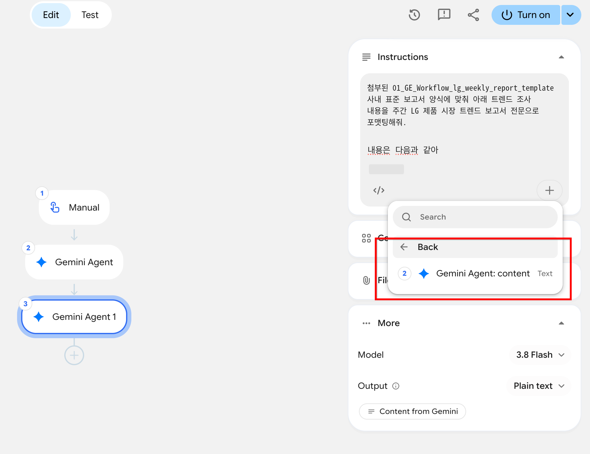

3. **`Files`에 사내 표준 양식 마크다운 파일(`.md`) 첨부**: 우측 패널 중앙의 <strong>`Files 0`</strong> 옆 <strong>`+` 버튼 (`Ground the agent in your data`)</strong>을 클릭하여 실습 폴더의 마크다운 템플릿 파일 **[`01_GE_Workflow_lg_weekly_report_template.md`](./files/01_GE_Workflow_lg_weekly_report_template.md)**를 첨부파일로 넣습니다.

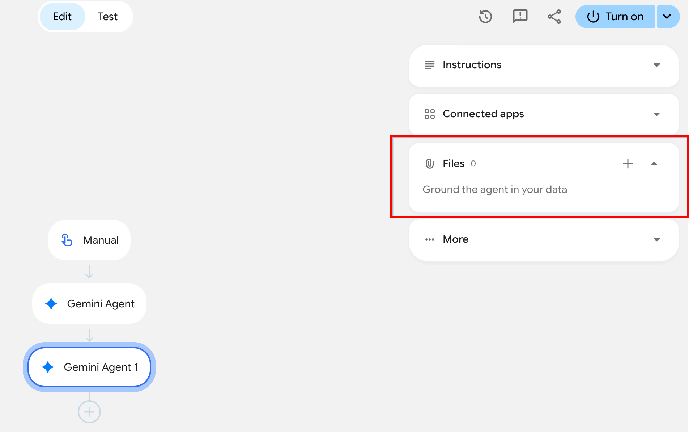

4. **`Files 1` 첨부 확인 & `Structured output` (`= content`) 설정**: 템플릿 `.md` 파일이 첨부되어 <strong>`Files 1`</strong>로 바뀐 것을 확인하고, 1단계와 동일하게 하단 <strong>`More` ➔ `Output` ➔ `Structured output`</strong>을 선택해 <strong>`content` (`Text`)</strong> 단일 변수를 등록합니다.


---

#### ④ `4. Approval` — 3단계: `HITL (Human-in-the-Loop)` 사람 검토·승인 게이트
1. **`Human in the Loop` ➔ `Approval` 노드 추가**: `Gemini Agent 1` 아래 <strong>`+ Add step`</strong>을 클릭한 뒤, 우측 패널에서 <strong>`Human in the Loop`</strong> 카테고리를 펼치고 <strong>`Approval`</strong>을 선택합니다. (캔버스에 초록색 `Approved` / 회색 `Rejected` 갈림길이 자동 생성됩니다.)

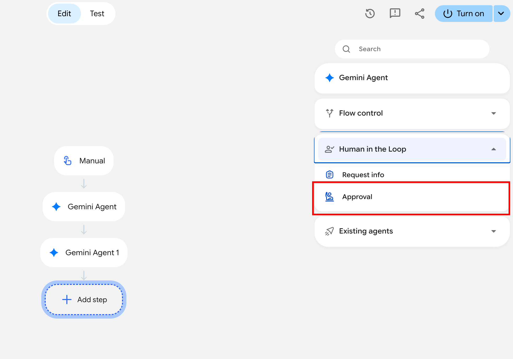

2. **`Approval` ➔ `Message`에 `3 ✨ Gemini Agent 1: content` 변수 삽입**: 우측 패널 <strong>`Message`</strong> 입력칸 우측 하단의 <strong>`+` 아이콘 ➔ `{} Variables`</strong>를 누르고, 포맷팅이 완료된 보고서 변수인 <strong>`3 ✨ Gemini Agent 1: content` (`Text`)</strong>를 클릭합니다.


3. **결재 요청 문구 작성**: 삽입된 <strong>`Gemini Agent 1: content`</strong> 변수 아래에 아래와 같이 결재 확인 문구를 입력합니다:

```text
Gemini Agent 1: content
결재하시겠습니까?
```


---

#### ⑤ `5. Gemini Agent 2` — 4단계: 승인(`Approved`) 시 내 Gmail 임시보관함 드래프트 생성
1. **`Approved` 분기 아래에 `Gemini Agent 2` 추가 & `content` 변수 삽입**: 캔버스의 초록색 <strong>`Approved`</strong> 경로 아래 <strong>`+` 버튼</strong>을 눌러 <strong>`Gemini Agent 2`</strong>를 추가합니다. 우측 <strong>`Instructions`</strong> 칸에서 <strong>`+` ➔ `{} Variables` ➔ `3 ✨ Gemini Agent 1: content` (`Text`)</strong>를 클릭해 승인된 보고서 본문을 불러옵니다.


2. **`Connected apps`에서 `Gmail` 세부 권한 토글 확인**: 우측 패널의 **`연결된 앱`**에서 `Gmail`을 클릭해 펼친 뒤, 메일 초안 생성을 위해 **`데이터 추가 또는 업데이트하기`** 스위치가 **ON (파란색)**으로 켜져 있는지 확인합니다. *(Step 2-0에서 이미 사전에 `작업 사용 설정` ➔ `Allow` 승인을 마쳤으므로 바로 스위치를 켤 수 있습니다.)*

👉 **화면 확인 포인트:** (`연결된 앱 ➔ Gmail 펼치기 ➔ '데이터 추가 또는 업데이트하기' 토글 ON 확인`)
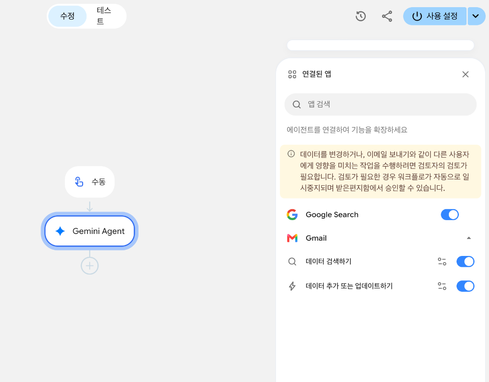

3. **Gmail 드래프트 생성 프롬프트 완성**: `Instructions`의 <strong>`Gemini Agent 1: content`</strong> 변수 뒤에 아래 지시문을 입력합니다 (최종 단계이므로 `Output`은 기본 `Plain text` 그대로 둡니다):

```text
Gemini Agent 1: content
해당 내용으로 메일 드래프트를 써놔
```

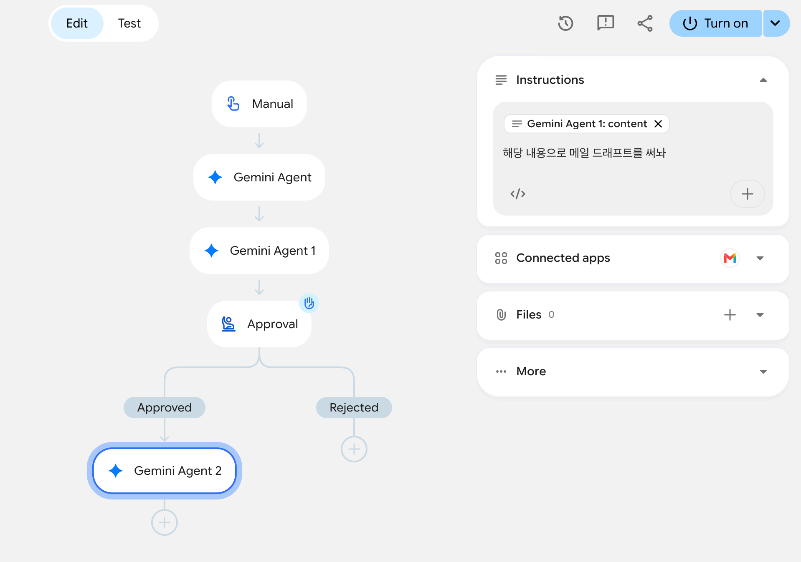

---

#### ⑥ 워크플로우 활성화(`Turn on`) 및 테스트(`Test`) 실행
* 5개 노드(`Manual` ➔ `Gemini Agent` ➔ `Gemini Agent 1` ➔ `Approval` ➔ `Gemini Agent 2`) 설정이 모두 끝났다면, 화면 우측 상단의 파란색 <strong>`Turn on`</strong> 버튼을 눌러 워크플로우를 활성화하고 좌측 상단의 <strong>`Test`</strong> 탭을 눌러 실행을 시작합니다!

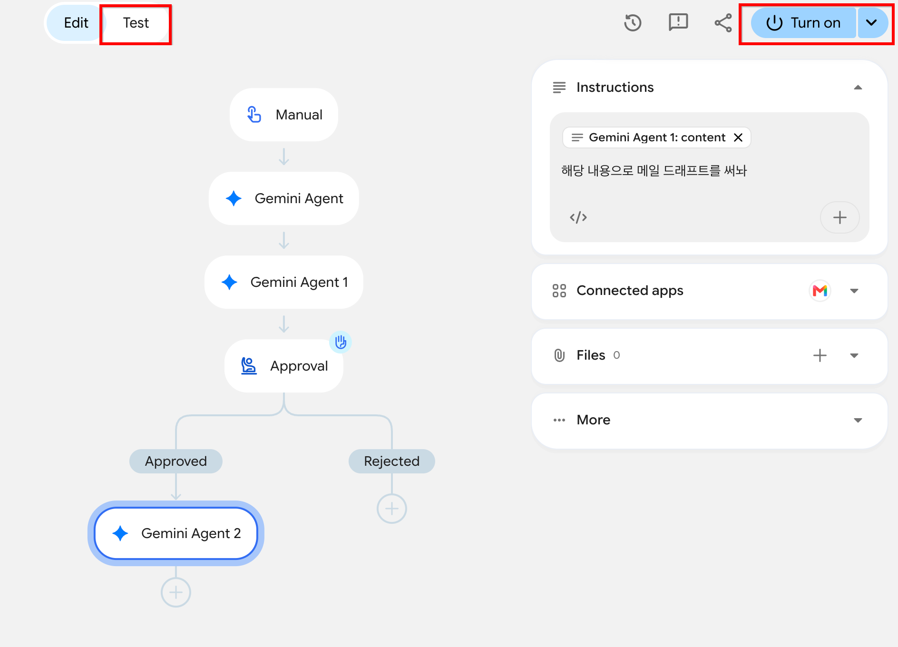

---

### 🔹 Step 2-2. `HITL (Human-in-the-Loop)` — 상사 메일 포워딩 전 사람이 검토·승인하기

> <strong>🎯 핵심 포인트:</strong> AI가 틀린 내용을 마음대로 보내지 못하도록 잠시 멈추고, <strong>사람이 눈으로 확인해 `[Approved]`(승인)를 눌렀을 때만</strong> 지메일에 저장되게 합니다.

1. 상단 <strong>`Test`</strong> 탭에서 워크플로우를 실행하면, 보고서 초안 생성 직후 <strong>`Approval`</strong> 단계에서 자동 대기 상태가 됩니다.
2. 생성된 보고서의 수치 출처와 내용을 검토한 뒤 <strong>`[Approved]`</strong>를 클릭합니다.
3. 우측 패널에 초록색 체크와 함께 <strong>`The AI trends report workflow has completed, and a Gmail draft has been successfully created for you.`</strong> 완료 메시지가 뜨는지 확인합니다.

👉 **화면 확인 포인트:** (`Approval` 통과 후 Gmail Draft 생성 완료 메시지)


---

### 🔹 Step 2-3. 내 Gmail `[임시보관함(Drafts)]`에 생성된 사내 표준 보고 메일 최종 확인하기

1. 내 <strong>Gmail</strong>을 열고 좌측 <strong>`임시보관함(Drafts)`</strong> 탭을 클릭합니다.
2. 방금 워크플로우가 만들어 놓은 <strong>`[사내 표준] 주간 LG 제품 시장 트렌드 보고서`</strong> 메일을 엽니다.
3. 상단 `📌 [Executive Summary] 금주 핵심 요약 (3줄)`과 하단 `📊 제품군별 글로벌 시장 트렌드 비교표` 서식이 깔끔하게 들어왔는지 확인합니다.

👉 **화면 확인 포인트:** (내 Gmail 임시보관함에 생성된 `[사내 표준] 주간 LG 제품 시장 트렌드 보고서`)
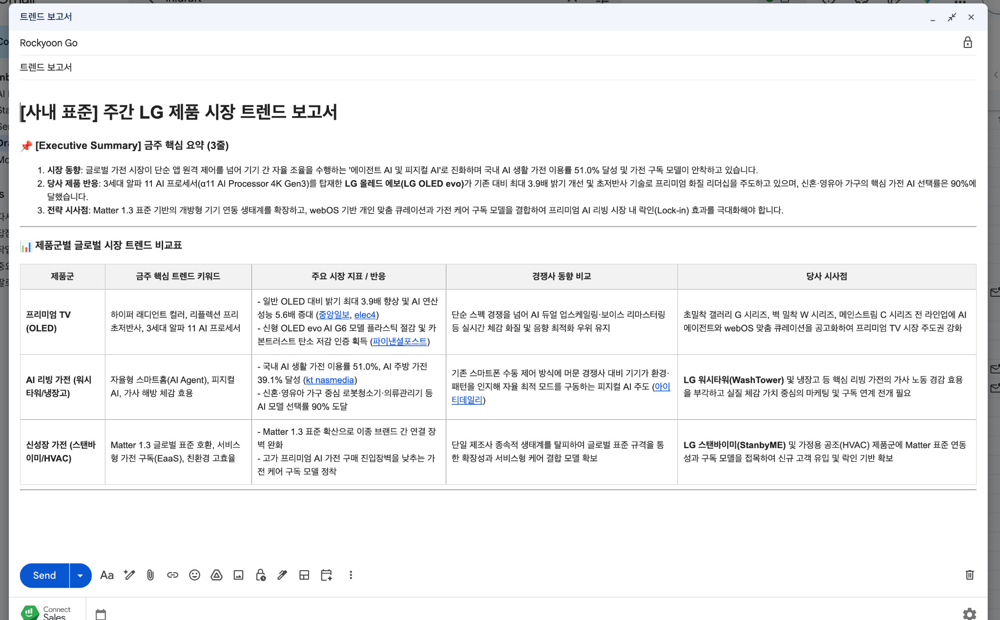

---

### 🔹 Step 2-4. [심화] `Flow control ➔ If / else` 조건 분기 & `Rejected` 반려 피드백 노드 직접 확장하기

> <strong>🎯 핵심 포인트:</strong> 현업 자동화에서는 단순 승인 외에도 <strong>① 특정 조건(`If / else`)에 따라 수신자별 메일 포맷을 다르게 생성</strong>하거나, <strong>② 반려(`Rejected`) 시 보완 지시를 내려 재작성</strong>하는 분기 설계가 필수입니다.

#### 1️⃣ `Approved` 아래에 `Flow control ➔ If / else` 조건 분기 추가하기
1. 상단 **`Edit`** 탭으로 돌아가 `Approval` 노드의 **`Approved`** 경로 아래 `+` 버튼을 클릭하고 **`Flow control` ➔ `If / else`**를 선택합니다.
2. 조건(`Condition`) 설정에서 **`3 ✨ Gemini Agent 1: content`** 변수를 선택하고, 특정 조건(예: 본문에 **`"관세"`** 또는 **`"리스크"`** 단어 포함 여부 `contains`)을 지정합니다.
3. **`If`(조건 충족 시)** 아래의 에이전트 노드에는 아래 지시문을 넣어 **임원/팀장님 긴급 보고용 핵심 3줄 요약 메일 초안**을 생성하게 합니다:

```text
Gemini Agent 1: content
위 보고서에서 경영진이 즉시 의사결정해야 할 핵심 리스크와 대응책만 3줄로 압축해서 제목 앞에 '[긴급/임원보고]'를 붙여 Gmail 임시보관함 드래프트로 저장해줘.
```

4. **`Else`(그 외 일반 상황)** 아래에는 기존처럼 **실무진 공유용 전체 비교표 상세 메일 초안** 노드를 연결합니다.

#### 2️⃣ `Rejected`(반려) 갈림길 아래에 보완 재작성 에이전트 추가하기
1. `Approval` 노드의 회색 **`Rejected`** 경로 아래 **`+` 버튼 ➔ `Gemini Agent`**를 추가합니다.
2. 우측 `Instructions`에 **`3 ✨ Gemini Agent 1: content`** 변수를 넣고 아래 반려 보완 지시문을 입력합니다:

```text
Gemini Agent 1: content
결재가 반려되었습니다. 위 보고서에서 출처([매체명, 날짜])가 불명확하거나 추측성인 수치를 모두 제거하고, 확인된 팩트 위주로 보수적으로 재작성한 뒤 제목 앞에 '[재검토용]'을 붙여 Gmail 임시보관함에 저장해줘.
```

---

# 💻 [2부 · 데스크톱 앱] Part 3. Antigravity 웹 슬라이드 & AI 이미지 직접 생성·편집
### 🔹 Step 3-0. [필수] 실습 시작 전 `Settings (⚙️)` 권한 점검하기

> <strong>⚠️ Antigravity 첫 실행 시 기본 권한 설정을 먼저 확인하세요!</strong>  
> 에이전트가 작업 폴더에 파일을 생성하고, 구현 계획서(`Implementation Plan`) 승인 후 코딩하며, `/browser`로 크롬 화면을 제어할 수 있도록 좌측 하단 <strong>`⚙️ Settings` ➔ `General`</strong>의 3가지 설정값을 확인합니다.

#### 1️⃣ `Settings ➔ General` 상단 확인: `Permission Preset` & `Artifact Review Policy`
* 좌측 하단 <strong>`⚙️ Settings`</strong> 클릭 ➔ <strong>`General`</strong> 탭에서 <strong>`Permission Preset: Default`</strong> (또는 `Turbo`), <strong>`Artifact Review Policy: Always Ask`</strong> 상태를 확인합니다.


#### 2️⃣ `Settings ➔ General` 아래로 스크롤: `Browser Javascript Execution Policy` 확인
* 같은 창에서 아래로 스크롤하여 <strong>`Browser`</strong> 항목의 <strong>`Browser Javascript Execution Policy`</strong>가 `Disabled`(차단)가 아닌 <strong>`Request Review`</strong>(또는 `Always Proceed`)로 설정되어 있는지 확인합니다.

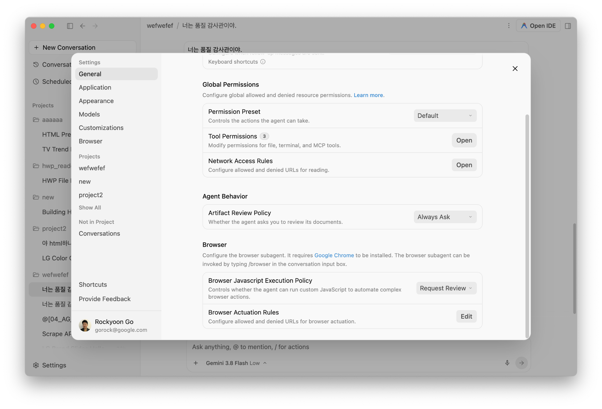

---

### 🔹 Step 3-1. `/grill-me` 역질문 인터뷰 & 구현 계획 승인하기

> <strong>🎯 핵심 포인트:</strong> 프롬프트를 길게 고민할 필요 없이 <strong>`/grill-me`</strong> 한 줄만 치면, <strong>AI가 먼저 질문을 던져 기획을 잡아주고 승인 즉시 `index.html` 코딩을 시작</strong>합니다.

#### 1️⃣ 작업 폴더 열기 & `/grill-me` 스킬 칩 선택 후 프롬프트 입력
로컬 작업 폴더(예: `C:/Users/abcd/lg-work-portal`)를 열고, 채팅 입력창에 먼저 **`/grill-me`를 타이핑한 뒤 `[Tab]` 키를 눌러 스킬 칩을 띄우고**, 이어서 아래 프롬프트 문장을 복사해 붙여넣습니다:

```text
/grill-me LG AI 가전 트렌드 보고서를 3장 분량의 슬라이드로 구성해서 현재 폴더에 단일 웹페이지(index.html) 파일 형태로 간결하게 만들어줘.
```

#### 2️⃣ 에이전트의 역질문에 답변하기 (객관식 카드 `Submit ↵` 또는 채팅 답변)
`/grill-me`를 실행하면 에이전트가 <strong>우선순위 기능</strong>과 <strong>발표자 노트 레이아웃 방식</strong> 등을 물어봅니다. 아래 화면처럼 객관식 카드가 뜨면 원하는 항목(예: `1번 Recommended`)을 선택하고 우측 하단 파란색 <strong>`Submit ↵`</strong> 버튼을 누릅니다. *(만약 카드 대신 일반 채팅 문장으로 물어보면 채팅창에 원하는 방향을 짧게 답해주면 됩니다.)*

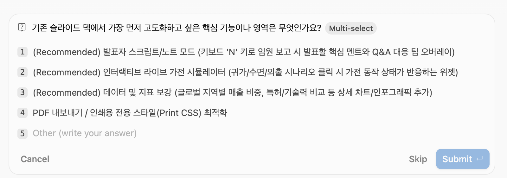


#### 3️⃣ 구현 계획(`Implementation Plan`) 확인 및 진행 승인 (`[Proceed ⌘↩]` 또는 채팅 답변)
질문에 답하고 나면 에이전트가 구현 계획을 정리해 보여줍니다.
* 아래 화면처럼 **`Implementation Plan` 카드와 파란색 `[Proceed ⌘↩]` 버튼이 뜨면 `[Proceed ⌘↩]` 버튼을 클릭**합니다.
* 만약 버튼 대신 **채팅 문장으로 진행 여부를 물어보면 `"응, 이대로 index.html 파일로 만들어줘"`라고 입력**해 실제 `index.html` 코드 생성을 시작합니다.


---

### 🔹 Step 3-2. 생성된 발표용 웹 슬라이드(`index.html`) 브라우저에서 열어 확인하기

1. 에이전트가 생성한 `index.html`을 브라우저에서 열어 슬라이드 장표들을 넘겨봅니다.
2. *(확인 포인트: 아래 두 화면처럼 슬라이드 구조와 차트는 멋지게 나왔지만, <strong>아직 LG 브랜드 컬러 스킬을 입히기 전이라 색감이 매번 랜덤으로 생성</strong>됩니다.)*


---

### 🔹 Step 3-3. 참여자 자유 구성 추가(`/plan`) & `/btw` · `/learn`으로 내 슬라이드 규칙 저장하기

#### 1️⃣ [1단계: `/plan`으로 장표 추가] 채팅창에 `/plan` + `[Tab]` 선택 후 아래 프롬프트 복사·붙여넣기
내가 보고서에 더 넣고 싶은 데이터(예: 주요 국가 구매력 지수 GDP 비교)를 채팅창에 **`/plan` 타이핑 후 `[Tab]` 키**를 눌러 추가 지시합니다. *(작업 도중 궁금한 점은 하단 **`/btw` (`Side Question`)** 입력창을 통해 작업 흐름을 끊지 않고 물어볼 수 있습니다.)*

```text
/plan 추가로 지금 현재 세계 주요 나라의 GDP(구매력지수 PPP 기준) 비교 슬라이드를 추가해줘.
```

👉 **1단계 실행 화면:** (`/plan`으로 새 장표 구성 계획이 수립되면 **`Proceed`**를 눌러 슬라이드에 반영합니다!)


#### 2️⃣ [2단계: `/learn`으로 규칙 저장] 채팅창에 `/learn` + `[Tab]` 선택 후 아래 프롬프트 복사·붙여넣기
새 장표까지 잘 추가되었다면, 앞으로 만드는 모든 슬라이드에도 동일한 하단 페이지 번호·단축키 안내가 자동으로 들어가도록 채팅창에 **`/learn` 타이핑 후 `[Tab]` 키**를 눌러 나만의 규칙으로 영구 저장합니다:

```text
/learn 발표 슬라이드 하단에는 항상 페이지 번호(1/N)와 단축키 안내(방향키 이동, N 발표자 노트)를 표시하도록 규칙으로 저장해줘.
```

---

### 🔹 Step 3-4. `/lg-brand-slides` 스킬 적용 — LG 브랜드 색감(`Hex #A50034` 레드 & 화이트) 영구 고정!

> <strong>🎯 핵심 포인트:</strong> 수정할 때마다 슬라이드 색깔이 제멋대로 바뀌지 않도록, <strong>`/lg-brand-slides` 스킬을 등록해 LG 레드(`#A50034`)와 화이트 배경으로 한 번에 고정</strong>합니다.

#### 1️⃣ [1단계: 스킬 등록] 프로젝트 폴더에 `02_AG_Webpage_lg_brand_slides_SKILL.md` 파일 넣고 스킬로 등록하기
먼저 다운로드한 <strong>[`02_AG_Webpage_lg_brand_slides_SKILL.md`](./files/02_AG_Webpage_lg_brand_slides_SKILL.md)</strong> 파일을 **현재 열려 있는 Antigravity 프로젝트 폴더(예: `lg-work-portal`) 안에 복사해 넣어야** `@멘션`으로 불러올 수 있습니다. 준비되었다면 채팅창에 **`@02_AG_Webpage_lg_brand_slides_SKILL.md`를 타이핑 후 `[Tab]` 키**로 선택하고 아래 문장을 붙여넣어 스킬로 등록합니다:

```text
@02_AG_Webpage_lg_brand_slides_SKILL.md 이 파일을 프로젝트 스킬(lg-brand-slides)로 등록해줘.
```

> 💡 **1단계 완료 확인:** 에이전트가 프로젝트 내 스킬 폴더(`.agent/skills/lg-brand-slides/SKILL.md`)에 등록을 완료했다고 답하면 1단계 성공입니다! *(슬래시 목록에 바로 안 보이면 키보드 **`Ctrl + R`**로 창을 한 번 새로고침해 주세요.)*

#### 2️⃣ [2단계: `/lg-brand-slides` 스킬 실행] 채팅창에 `/lg-brand-slides` + `[Tab]` 선택 후 아래 프롬프트 복사·붙여넣기
이제 방금 등록한 스킬을 대화창에서 직접 불러와 적용해 봅니다. 채팅창에 **`/lg-brand-slides`를 타이핑한 뒤 `[Tab]` 키로 스킬 칩을 선택**하고, 이어서 아래 프롬프트 문장을 복사해 붙여넣습니다:

```text
/lg-brand-slides 스킬을 적용해서 빠르게 수정해줘.
```

👉 **실행 결과 화면:** (랜덤 색감이었던 슬라이드가 화이트 + LG 시그니처 레드 `#A50034`로 100% 변환된 모습!)
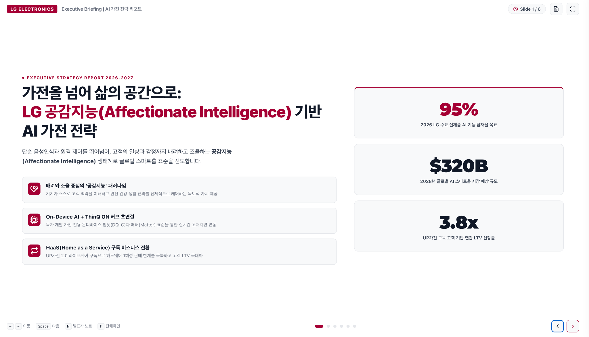

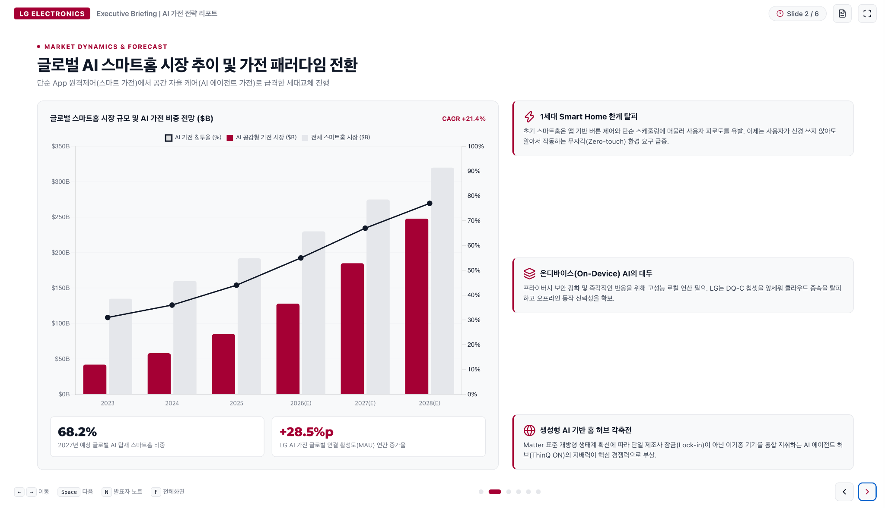

---

### 🔹 Step 3-5. [심화] 슬라이드 내 인터랙티브 가전 전력 시뮬레이터 & 키보드 `N` 발표자 Q&A 드로어 탑재하기

> <strong>🎯 핵심 포인트:</strong> 일반 PPT와 달리 웹 슬라이드(`HTML/JS`)는 **장표 안에서 버튼을 눌러 수치를 시뮬레이션**하거나 **키보드 `N` 키로 임원 예상 Q&A 커닝페이퍼**를 띄울 수 있습니다.

#### 1️⃣ [1단계: 인터랙티브 전력 절감 시뮬레이터 위젯 추가]
먼저 3번째 슬라이드 장표에 모드 버튼 클릭 시 가전별 전력 절감량(kWh)과 월 절감 요금이 실시간 게이지로 바뀌는 시뮬레이터 위젯을 넣습니다:

```text
현재 웹 슬라이드(index.html)의 3번째 장표 안에 [귀가 모드] / [취침 모드] / [외출 절전 모드] 버튼 3개를 만들고, 클릭할 때마다 에어컨·워시타워·조명의 예상 전력 절감량(kWh) 게이지 바와 월 예상 절감액(원)이 실시간으로 바뀌는 인터랙티브 시뮬레이터 카드를 추가해줘.
```

#### 2️⃣ [2단계: 키보드 `N` 발표자 예상 Q&A 슬라이딩 패널 추가]
이어서 발표 도중 키보드 `N` 키를 눌렀을 때 우측에서 현재 장표에 맞는 발표 대본과 임원 예상 질문·모범 답변이 슬라이딩 패널로 열리도록 추가합니다:

```text
키보드 'N' 키(또는 우측 상단 버튼)를 누르면 화면 우측에서 슬라이딩 드로어가 열리면서, 현재 보고 있는 슬라이드 장표에 맞춘 ① 발표자 구어체 스크립트와 ② 임원 예상 압박 질문 2개 및 모범 답변이 표시되게 구현해줘.
```

---

### 🔹 Step 3-6. [AG 신기능 체험] 내장 AI 이미지 직접 생성(`Image Generation`) & 연속 편집(`Image-to-Image`)으로 히어로 배너 장착!

> <strong>🎯 핵심 포인트 (시간 순삭 신기능!):</strong> Antigravity 에이전트는 **자체 이미지 생성 도구(`generate_image`)**를 내장하고 있습니다. 외부 이미지 사이트에 갈 필요 없이 **제품 컨셉 화보·배너·아이콘을 직접 그려서 로컬 폴더에 저장하고 `index.html` 슬라이드에 바로 끼워 넣는 과정**을 체험합니다!

#### 1️⃣ [1단계: AI 화보 직접 생성 & 1페이지 자동 삽입]
채팅창에 아래 프롬프트를 입력해 AI가 직접 16:9 화보를 그리고 웹 슬라이드 1페이지에 넣게 시켜봅니다:

```text
유럽 모던 거실에 놓인 차세대 LG OLED evo와 AI 워시타워 컨셉 화보 이미지를 16:9 비율로 직접 생성해서, 우리 웹 슬라이드 1페이지 우측 히어로 배너에 바로 넣어줘.
```

#### 2️⃣ [2단계: `Image-to-Image` 연속 이미지 편집]
방금 생성된 이미지를 바탕으로, 프롬프트 한 줄로 톤앤매너와 홀로그램 UI 연출까지 연속 수정(`Image-to-Image`)해 봅니다:

```text
방금 생성한 히어로 배너 이미지를 세련된 다크모드 톤으로 바꾸고 미래지향적인 ThinQ AI 홀로그램 UI 연출을 추가해서 1페이지 배너에 다시 반영해줘.
```

---

# 📊 [2부 · 데스크톱 앱] Part 4. 멀티 탭 포털 · 4대 계열사 시세·신호등 뉴스 & Vision 복제·인라인 위젯
### 🔹 Step 4-1. 왼쪽 사이드 탭 업무 포털 전환 & `1번 메뉴(LG 시장 트렌드)`에 슬라이드 탑재

> <strong>🎯 핵심 포인트:</strong> 왼쪽에 메뉴바를 만들고, <strong>방금 만든 웹 슬라이드를 `1번 메뉴(LG 시장 트렌드)` 안에 쏙 넣습니다.</strong>

#### 1️⃣ 아래 프롬프트를 복사·붙여넣어 좌측 사이드바 포털 구조로 즉시 전환하기
단일 슬라이드였던 웹페이지를 앞으로 새로운 탭을 차례대로 추가할 수 있는 **좌측 사이드바 업무 포털** 구조로 바로 전환합니다:

```text
지금 만든 index.html에 왼쪽 사이드바 메뉴 레이아웃을 추가해서 업무 포털 구조로 바꿔줘. 다른 불필요한 탭은 만들지 말고, 사이드바 1번 메뉴를 'LG 시장 트렌드'로 만들어서 방금 만든 웹 슬라이드를 그 안에 그대로 넣어줘.
```

> 💡 **계획 승인 (`[Proceed ⌘↩]`):** 구현 계획(`Implementation Plan`) 카드가 뜨면 **`[Proceed ⌘↩]`** 버튼을 눌러 즉시 포털 화면을 생성합니다.

👉 **실행 결과 화면:** (`업무 메뉴` 좌측 사이드바 `1. LG 시장 트렌드` 탭 안에 웹 슬라이드가 탑재된 포털!)


---

### 🔹 Step 4-2. 실시간 데이터 수집 스킬 등록 & `실시간 시장·뉴스 LIVE` 탭 연동

> <strong>🎯 핵심 포인트:</strong> 준비된 파이썬 파일([`03_AG_Dashboard_fetch_lg_live_market.py`](./files/03_AG_Dashboard_fetch_lg_live_market.py))을 스킬로 등록해 <strong>① LG전자 주가, ② 실시간 환율, ③ 구글 뉴스 5건</strong>을 <strong>2번 탭(`실시간 시장·뉴스 LIVE`)</strong>에 바로 띄웁니다.

<details class="file-list-details">
<summary><strong>🐍 (참고) 실시간 시장·뉴스 수집 코드 내용 펼쳐보기 (`03_AG_Dashboard_fetch_lg_live_market.py` — 클릭하여 펼치기)</strong></summary>

```python
import urllib.request, urllib.parse, json, ssl, xml.etree.ElementTree as ET

def _get(url):
    ctx = ssl._create_unverified_context()
    req = urllib.request.Request(url, headers={"User-Agent": "Mozilla/5.0"})
    return urllib.request.urlopen(req, timeout=5, context=ctx).read()

def fetch_lg_live_dashboard_data(stock_code="066570", keyword="LG전자 AI 가전"):
    # 1. 네이버 금융 LG전자(066570) 실시간 주가·등락률 조회
    stock = json.loads(_get(f"https://m.stock.naver.com/api/stock/{stock_code}/basic").decode("utf-8"))
    # 2. 글로벌 실시간 환율(USD/KRW, EUR, JPY) 조회
    fx = json.loads(_get("https://api.frankfurter.dev/v1/latest?base=USD&symbols=KRW,EUR,JPY").decode("utf-8"))
    # 3. 구글 뉴스 실시간 'LG전자 AI 가전' 최신 헤드라인 5건 조회
    rss_url = f"https://news.google.com/rss/search?q={urllib.parse.quote(keyword)}&hl=ko&gl=KR&ceid=KR:ko"
    root = ET.fromstring(_get(rss_url))
    news = [{"title": item.findtext("title"), "pubDate": item.findtext("pubDate"), "link": item.findtext("link")} for item in root.findall(".//item")[:5]]
    return {"stock_name": stock.get("stockName", "LG전자"), "close_price": stock.get("closePrice"), "fluctuation_rate": stock.get("fluctuationsRatio"), "usd_krw": fx["rates"]["KRW"], "latest_news": news}
```

</details>

#### 1️⃣ [1단계: 스킬 등록] 프로젝트 폴더에 `03_AG_Dashboard_fetch_lg_live_market.py` 파일 넣고 스킬로 등록하기
먼저 <strong>[`03_AG_Dashboard_fetch_lg_live_market.py`](./files/03_AG_Dashboard_fetch_lg_live_market.py)</strong> 파일이 **현재 프로젝트 폴더(`lg-work-portal`) 안에 들어있는지 확인**합니다. 그다음 채팅창에 **`@03_AG_Dashboard_fetch_lg_live_market.py`를 타이핑 후 `[Tab]` 키**로 선택하고 아래 문장을 붙여넣어 `python-api-trend` 스킬로 등록합니다:

```text
@03_AG_Dashboard_fetch_lg_live_market.py 해당하는 파이썬 코드를 스킬로 등록시켜줘. (python-api-trend)
```

> 💡 **1단계 완료 확인:** 에이전트가 파이썬 스크립트를 기반으로 `python-api-trend` 스킬 생성을 마쳤다고 답하면 1단계 완료입니다. *(슬래시 목록에 안 보일 때는 `Ctrl + R`로 새로고침)*

#### 2️⃣ [2단계: `/python-api-trend` 실행] 채팅창에 `/python-api-trend` + `[Tab]` 선택 후 아래 프롬프트 복사·붙여넣기
스킬 등록이 끝났다면 채팅창에 **`/python-api-trend`를 타이핑 후 `[Tab]` 키**로 스킬 칩을 띄우고, 아래 문장을 붙여넣어 대시보드 좌측 사이드바에 **2번 탭(`실시간 시장·뉴스 LIVE`)**을 만들고 실시간 주가·환율·뉴스 데이터를 연동합니다:

```text
/python-api-trend 스킬을 실행해 사이드바 '실시간 시장·뉴스(LIVE)' 탭에 LG전자(066570) 실시간 주가·환율(USD/KRW, EUR/KRW)과 구글 뉴스 헤드라인 5건(클릭 시 원문 이동)을 연결해줘.
```

👉 **실행 결과 화면:** (`실시간 시장·뉴스 LIVE` 탭 — LG전자 `214,500원 +5.93%`, 환율 `1,372.18원`, 실시간 뉴스 5건)


---

### 🔹 Step 4-3. 우측 상단 `[오늘의 LG 트렌드 & 뉴스 Pull]` 버튼 & `/schedule` 매일 아침 9시 자동화

#### 1️⃣ [1단계: 수동 갱신 버튼 추가] 대시보드 우측 상단에 원클릭 `Pull` 버튼 만들기
먼저 내가 원할 때 언제든 브라우저에서 버튼 한 번만 누르면 최신 시세와 뉴스를 다시 불러올 수 있도록, 우측 상단 헤더에 **`[오늘의 LG 트렌드 & 뉴스 Pull]`** 버튼을 추가합니다:

```text
대시보드 우측 상단에 '[오늘의 LG 트렌드 & 뉴스 Pull]' 버튼을 만들어서 클릭 시 최신 데이터로 갱신되게 해줘.
```

👉 **1단계 결과 화면:** (우측 상단 헤더에 빨간색 `[📥 오늘의 LG 트렌드 & 뉴스 Pull]` 원클릭 갱신 버튼 장착!)
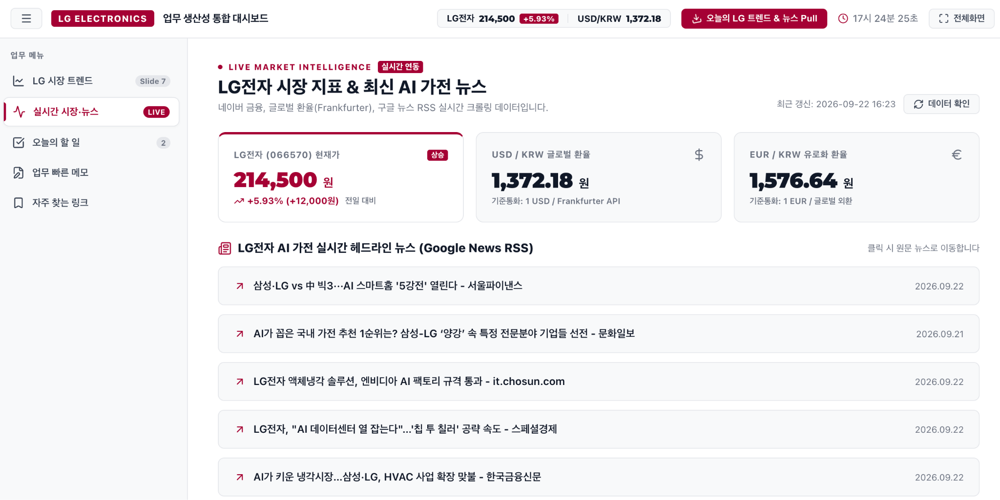

#### 2️⃣ [2단계: `/schedule` 자동화 등록] 매일 아침 9시 자동 업데이트 걸어두기
수동 버튼에 더해, 매일 아침 출근 전 9시 정각에 에이전트가 알아서 최신 트렌드·뉴스 데이터를 업데이트해 두도록 채팅창에 **`/schedule`을 타이핑 후 `[Tab]` 키**를 누르고 아래 문장을 붙여넣습니다:

```text
/schedule 매일 오전 9시에 트렌드 데이터 및 뉴스 데이터를 자동 업데이트해줘.
```

👉 **2단계 결과 화면:** (`/schedule` 명령어로 매일 아침 9시(`0 9 * * *`) 자동 갱신 스케줄(`1 task running`) 등록 완료!)


---

### 🔹 Step 4-4. [심화] 파이썬 스킬 개조 — LG 4대 핵심 계열사 실시간 주가 멀티 티커 바 탑재하기

> <strong>🎯 핵심 포인트:</strong> 현업에서는 LG전자 단독 주가뿐 아니라 주요 부품·배터리 계열사 지표를 함께 봅니다. 방금 등록한 `/python-api-trend` 파이썬 수집 스크립트를 개조해 **LG 4대 핵심 계열사 실시간 주가를 한 번에 수집하고 상단 헤더 멀티 티커**에 띄웁니다.

#### 1️⃣ 채팅창에 `/python-api-trend` + `[Tab]` 선택 후 4대 계열사 동시 수집 및 상단 티커 장착하기
채팅창에 **`/python-api-trend`를 타이핑 후 `[Tab]` 키**로 스킬을 선택하고 아래 문장을 붙여넣습니다:

```text
/python-api-trend 파이썬 수집 스크립트를 확장해서 LG전자(066570), LG이노텍(011070), LG디스플레이(034220), LG에너지솔루션(373220) 4대 계열사의 실시간 주가와 등락률을 한 번에 가져오게 수정하고, 대시보드 상단 헤더와 2번 탭에 'LG 4대 계열사 실시간 비교 티커 카드'를 표시해줘.
```

---

### 🔹 Step 4-5. [심화] 구글 뉴스 4대 전략 토픽 실시간 필터 탭 & 뉴스별 신호등(`🟢/🟡/🔴`) AI 시사점 배지 구현

> <strong>🎯 핵심 포인트:</strong> 단순 뉴스 나열을 넘어, **4대 전략 키워드별로 뉴스를 즉시 필터링**하고 각 기사마다 **`[🟢 기회 / 🟡 주시 / 🔴 리스크]` 신호등 배지와 1줄 핵심 시사점**이 함께 뜨도록 2번 탭을 고도화합니다.

#### 1️⃣ 아래 프롬프트를 입력해 2번 탭 뉴스 인텔리전스 보드 업그레이드하기
채팅창에 아래 프롬프트를 복사해 붙여넣습니다:

```text
2번 '실시간 시장·뉴스(LIVE)' 탭의 뉴스 영역 상단에 [전체 AI 가전] / [OLED evo & TV] / [유럽 HVAC 히트펌프] / [가전 구독(HaaS)] 4개 토픽 필터 버튼과 검색창을 만들고, 각 뉴스 카드마다 [🟢 기회 / 🟡 주시 / 🔴 리스크] 신호등 배지와 '당사 1줄 시사점' 요약 줄이 함께 표시되도록 빠르게 업그레이드해줘.
```

---

### 🔹 Step 4-6. [심화] 포털 상단 글로벌 컨트롤 바 (`KRW ⇄ USD 실시간 통화 환산` + `다크/라이트 테마` + `LocalStorage` 보존)

> <strong>🎯 핵심 포인트:</strong> 글로벌 본부 보고 시 원화(`KRW`)와 달러(`USD`) 기준을 번갈아 확인해야 합니다. 상단 헤더에 **실시간 환율 연동 `KRW ⇄ USD` 스위치**와 **테마 토글**을 달고, 브라우저를 새로고침해도 내 설정이 유지(`localStorage`)되게 만듭니다.

#### 1️⃣ 상단 헤더에 통화 환산 스위치 & 테마 토글 장착하기
채팅창에 아래 프롬프트를 복사해 붙여넣습니다:

```text
포털 우측 상단 헤더에 [🇰🇷 KRW 원화 ⇄ 🇺🇸 USD 달러] 통화 전환 스위치와 [☀️ 라이트 ⇄ 🌙 다크] 테마 토글 버튼을 추가해줘. 통화 스위치를 누르면 수집된 실시간 USD/KRW 환율을 기준으로 화면 내 주가와 매출 금액 단위가 원화/달러로 즉시 환산되게 하고, 선택한 통화와 테마 설정은 localStorage에 자동 저장되게 해줘.
```

---

### 🔹 Step 4-7. [AG 신기능 체험] 손그림·화면 캡처 1분 복제(`Vision-to-Code`) & 채팅창 인라인 위젯(`Generative UI`)

> <strong>🎯 핵심 포인트 (신기한 비전 & 인라인 UI 기능!):</strong>  
> 1. **`Vision-to-Code`**: 메모장에 대충 그린 표나 마음에 드는 웹사이트(예: 애플·다이슨 제품 비교표) 화면을 **`Win + Shift + S`**로 캡처해 채팅창에 **`Ctrl + V`**로 붙여넣으면 1분 만에 똑같이 작동하는 웹 카드로 복제해 줍니다.  
> 2. **`Generative UI`**: `index.html` 브라우저를 열지 않아도 **Antigravity 채팅 답변 영역 안에 바로 마우스로 움직일 수 있는 인터랙티브 계산기 위젯**을 즉시 띄워줍니다!

#### 1️⃣ [`Vision-to-Code` 실습] 화면 일부를 `Win + Shift + S`로 캡처 후 채팅창에 `Ctrl + V`로 붙여넣고 복제하기
아무 웹사이트나 슬라이드 표 영역을 **`Win + Shift + S`**로 캡처해 Antigravity 채팅 입력창에 **`Ctrl + V`**로 붙여넣은 뒤, 아래 문장을 입력해 봅니다:

```text
방금 붙여넣은 이미지의 레이아웃과 카드 구성을 그대로 참고해서, 우리 대시보드 2번 탭 하단에 'LG 주요 AI 가전 경쟁력 한눈에 비교하기' 섹션으로 똑같이 동작하게 만들어줘.
```

#### 2️⃣ [`Generative UI` 실습] 채팅창 답변 영역 안에 바로 작동하는 '가전 구독 TCO 계산기 위젯' 띄우기
이번에는 파일을 수정하는 대신, **채팅창 대화 화면 안에 바로 마우스로 슬라이더를 조작할 수 있는 인라인 위젯**을 띄워봅니다:

```text
채팅창 안에서 바로 마우스 슬라이더를 움직여 테스트해볼 수 있는 'LG 가전 구독(HaaS) 3년 vs 5년 총소유비용(TCO) 및 케어십 혜택 비교 계산기' 인터랙티브 위젯을 바로 띄워줘.
```

---

# 📈 [2부 · 데스크톱 앱] Part 5. LG 5대 가전 920행 데이터 엔지니어링 · 히트맵 · 3축 What-if 시뮬레이터 & 보고서 추출기
### 🔹 Step 5-0. 데이터셋(`04_AG_Analytics_lg_appliance_data.csv`, 920행) 로딩 및 컬럼 확인

#### 1️⃣ 로컬 폴더에 `04_AG_Analytics_lg_appliance_data.csv` 넣고 `@멘션`으로 읽어오기
먼저 프로젝트 폴더(`lg-work-portal`) 안에 <strong>[`04_AG_Analytics_lg_appliance_data.csv`](./files/04_AG_Analytics_lg_appliance_data.csv)</strong> 파일이 들어있는지 확인한 뒤, 채팅창에 **`@04_AG_Analytics_lg_appliance_data.csv`를 타이핑 후 `[Tab]`으로 선택**하고 아래 문장을 입력해 5대 주력 가전(`OLED evo`, `DIOS & Objet`, `WashTower & Tromm`, `Whisen & HVAC`, `StanbyME & Care`) 920행 데이터 구조가 정상 인식되는지 확인합니다:

```text
@04_AG_Analytics_lg_appliance_data.csv 이 데이터 몇개를 읽어봐봐
```

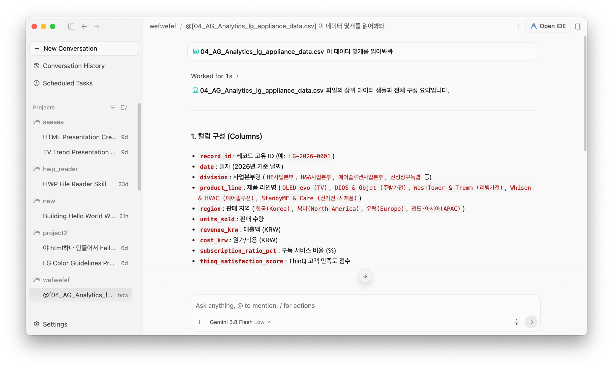

---

### 🔹 Step 5-1. [Step 1: Explore] 코딩 전 `ThinQ 점수 결측치(23건)` & `스탠바이미 시제품 매출 0원(18건)` 먼저 진단하기

> <strong>🎯 핵심 포인트:</strong> 데이터를 바로 차트로 그리면 <strong>빈칸(23건)</strong>이나 <strong>매출 0원짜리 시제품(18건)</strong> 때문에 평균 수치가 완전히 틀어집니다. 그래서 코딩 전에 <strong>숨은 오류 데이터부터 먼저 찾아냅니다.</strong>

#### 1️⃣ 채팅창에 `@04_AG_Analytics_lg_appliance_data.csv` + `[Tab]` 선택 후 아래 프롬프트 복사·붙여넣기
채팅창에 **`@04_AG_Analytics_lg_appliance_data.csv`를 타이핑 후 `[Tab]` 키**로 파일을 멘션한 뒤, **"아직 코드는 짜지 말고 결측치와 매출 0원 시제품 이상치부터 먼저 진단해 달라"**고 지시합니다:

```text
@04_AG_Analytics_lg_appliance_data.csv 이 LG 가전·TV 데이터의 제품군별(OLED evo, 워시타워, 디오스, HVAC, 스탠바이미) 결측치(ThinQ 점수 빈 값)와 마진 계산 시 주의할 이상치(스탠바이미 시제품 매출 0원)를 먼저 진단해줘. 아직 코드는 짜지 마.
```

👉 **실행 결과 화면:** (전체 920건 중 `thinq_satisfaction_score` 결측치 <strong>총 23건(2.50%)</strong> 제품군별 정밀 포착!)


---

### 🔹 Step 5-2. [Step 2A: Data Pipeline] 파이썬 정제·집계 스크립트(`build_analytics_json.py`)로 보정 전/후 수치 먼저 산출하기

> <strong>🎯 핵심 포인트:</strong> 920행 데이터를 AI가 손으로 베껴 쓰게 하면 느리고 계산 실수가 납니다. **파이썬 정제 스크립트(`build_analytics_json.py`)**를 먼저 만들어 실행함으로써 **① 시제품(0원 18건) 제외 전/후 마진율 차이**와 **② 워시타워 결측치(23건) 보정 전/후 점수**를 1초 만에 정확히 계산해 `analytics_summary.json`으로 뽑아냅니다.

#### 1️⃣ 채팅창에 `@04_AG_Analytics_lg_appliance_data.csv` + `[Tab]` 선택 후 파이썬 정제 스크립트 생성·실행하기
채팅창에 **`@04_AG_Analytics_lg_appliance_data.csv`를 타이핑 후 `[Tab]` 키**로 선택하고 아래 문장을 붙여넣습니다:

```text
@04_AG_Analytics_lg_appliance_data.csv 920행 데이터를 정확하게 정제·집계하는 파이썬 스크립트(build_analytics_json.py)를 만들고 실행해서, ① 스탠바이미 시제품(매출 0원, 18건) 포함 시 vs 제외 시 마진율 비교 수치, ② 워시타워 ThinQ 결측치(23건) 권역별 중앙값 보정 결과, ③ 5대 제품군 × 4대 권역별 매출·영업이익률·구독 전환율·반품률 집계 결과를 analytics_summary.json 파일로 생성하고 핵심 수치 요약을 출력해줘.
```

---

### 🔹 Step 5-3. [Step 2B: Core Dashboard] 3번째 사이드 탭 `[가전 실적·구독 분석 NEW]` & 시제품 실시간 토글 탑재하기

> <strong>🎯 핵심 포인트:</strong> 방금 파이썬으로 정확히 뽑아낸 집계 데이터를 `index.html`의 <strong>3번 탭(`📊 가전 실적·구독 분석 NEW`)</strong>에 인라인으로 주입하여, **상단 4대 KPI 카드 + `시제품(0원 18건) 포함/제외` 토글 스위치 + 핵심 차트 2종**을 탑재합니다.

#### 1️⃣ 3번 사이드 탭 및 핵심 차트 2종 구현하기
채팅창에 아래 프롬프트를 복사해 붙여넣습니다:

```text
방금 생성한 analytics_summary.json 집계 데이터를 index.html 안에 인라인으로 넣어서 3번째 사이드 탭 '가전 실적·구독 분석'을 만들어줘. 상단에는 4대 핵심 KPI 카드와 '스탠바이미 시제품(매출 0원, 18건) 포함/제외' 실시간 토글 필터, 워시타워 ThinQ 결측치(23건) 보정 리포트 배너를 배치하고, 중앙에는 ① 제품군별 매출·마진율 차트와 ② 권역별 HaaS 구독 전환율 차트를 깔끔하게 구성해줘.
```

👉 **실행 결과 화면:** (상단 4대 KPI 카드 + `시제품 18건 포함/제외` 필터 + 이상치·결측치 리포트 + 차트 2종 완성!)


---

### 🔹 Step 5-4. [Step 2C: Deep-Dive Matrix] `권역 × 제품군 수익성 히트맵(Heatmap)` 드릴다운 & 반품률·원가 이상징후(`⚠️ Anomaly`) 경보 테이블

> <strong>🎯 핵심 포인트:</strong> 평균 차트만으로는 **"어느 국가의 어느 제품군에서 마진이 새고 있는지"** 바로 보이지 않습니다. **4대 권역 × 5대 제품군 수익성 컬러 히트맵**(셀 클릭 시 드릴다운 필터링)과 **반품률 급증·저마진 이상징후(`⚠️ Anomaly`) 자동 경보 테이블**을 추가합니다.

#### 1️⃣ 수익성 히트맵 매트릭스 & 이상징후 자동 경보 테이블 추가하기
채팅창에 아래 프롬프트를 복사해 붙여넣습니다:

```text
3번 '가전 실적·구독 분석' 탭 하단에 두 가지 심화 분석 섹션을 추가해줘. ① '4대 권역(North America, Europe, Korea, Asia) × 5대 제품군 영업이익률 컬러 히트맵 매트릭스'(마진율 높으면 초록/블루, 낮으면 레드 계열 표시 및 셀 클릭 시 해당 권역·제품군 상세 수치 하이라이트)를 넣고, ② 우측에는 반품률(return_rate_pct) 상위 또는 마진율 급락 주의 구간 Top 5를 '⚠️ 이상징후(Anomaly) 경보 배지'와 함께 보여주는 진단 테이블을 추가해줘.
```

---

### 🔹 Step 5-5. [Step 2D: What-if Simulator] CFO/본부장 회의용 `환율·구독률·물류비 3축 What-if 손익 시뮬레이터` 탑재하기

> <strong>🎯 핵심 포인트:</strong> 임원 보고 자리에서 가장 많이 나오는 **"환율이 1,420원으로 오르고 구독 비중을 5%p 늘리면 영업이익이 얼마나 바뀌나?"**라는 질문에 그 자리에서 마우스 슬라이더로 즉시 답할 수 있는 **3축 What-if 시뮬레이터**를 장착합니다.

#### 1️⃣ 3축 슬라이더(`환율` · `구독 전환율` · `물류/원가 변동`) 실시간 시뮬레이터 구현하기
채팅창에 아래 프롬프트를 복사해 붙여넣습니다:

```text
3번 '가전 실적·구독 분석' 탭 상단에 '🎛️ CFO/본부장 보고용 3축 What-if 손익 시뮬레이터' 패널을 추가해줘. 마우스 슬라이더로 ① USD/KRW 환율(1,250원~1,500원), ② HaaS 구독 전환율 상승폭(0%p ~ +15%p), ③ 글로벌 물류·원가 변동률(-10% ~ +15%) 3가지를 조절하면, 5대 가전 제품군의 예상 연매출·영업이익 증감액(+/- 억 원)과 차트가 실시간으로 재계산되어 움직이게 만들고 [초기화] 버튼도 넣어줘.
```

---

### 🔹 Step 5-6. [Step 2E: Executive Report Builder] 4번째 사이드 탭 `[📝 임원 보고서 자동 빌더]` & 원클릭 `.md` / `.csv` 추출기 구현

> <strong>🎯 핵심 포인트:</strong> 대시보드에서 분석한 내용을 다시 보고서로 옮겨 적을 필요가 없도록, 좌측 사이드바에 **4번째 탭(`📝 임원 보고서 빌더`)**을 만들어 **탭 1(트렌드) + 탭 2(실시간 주가·환율·뉴스) + 탭 3(가전 실적·시제품 보정·What-if 시뮬레이션 결과)**를 한 장의 경영진 보고서로 자동 조립하고 파일(`.md`, `.csv`)로 즉시 내려받습니다.

#### 1️⃣ 4번째 사이드 탭(`📝 임원 보고서 빌더`) 및 `.md` / `.csv` 원클릭 다운로드 버튼 구현하기
채팅창에 아래 프롬프트를 복사해 붙여넣습니다:

```text
왼쪽 사이드바에 4번째 메뉴로 '📝 임원 보고서 빌더' 탭을 추가해줘. 이 탭을 열면 현재 대시보드의 ① 시장 트렌드 핵심 요약(탭 1), ② 4대 계열사 시세 및 주요 뉴스(탭 2), ③ 가전 920행 정제 KPI·시제품 18건 보정 결과·현재 What-if 시뮬레이터 설정값(탭 3)이 하나의 깔끔한 경영진 주간 보고서 양식으로 실시간 조합되어 보이게 하고, 우측 상단에 [📥 임원 보고서 마크다운(.md) 다운로드], [📊 정제 실적 요약표(.csv) 다운로드], [📋 클립보드 복사] 버튼 3개를 만들어 클릭 즉시 파일이 다운로드되게 구현해줘.
```

---

### 🔹 Step 5-7. [Step 3: Verify] `/browser`로 에이전트가 직접 크롬을 띄워 4개 탭·토글·슬라이더 자율 검증하기

> <strong>🎯 핵심 포인트:</strong> 사람이 일일이 눌러보는 대신, <strong>`/browser` 명령어로 AI가 직접 크롬을 띄워 4개 사이드 탭 전환, 시제품 토글, What-if 슬라이더 동작과 콘솔 에러 여부를 스스로 눌러보며 검증</strong>하게 합니다.

#### 1️⃣ 채팅창에 `/browser` + `[Tab]` 선택 후 아래 프롬프트 복사·붙여넣기
채팅창에 **`/browser`를 타이핑 후 `[Tab]` 키**로 브라우저 에이전트 칩을 띄우고, 로컬 대시보드의 4개 탭과 인터랙티브 컨트롤들을 자율 검증하게 합니다:

```text
/browser 로컬 대시보드(index.html)에 접속해서 1~4번 사이드 탭 전환, '스탠바이미 시제품 포함/제외' 토글, '3축 What-if 시뮬레이터 슬라이더' 조작 시 화면이 정상 갱신되고 콘솔 에러나 0 나눗셈 오류가 없는지 검증해줘.
```

👉 **화면 확인 포인트:** (에이전트가 스스로 Chrome을 실행해 각 사이드 탭을 캡처·분석하는 과정)


---

### 🔹 Step 5-8. [Step 4: Handoff & Assetize] 새 세션(`+ New Conversation`) 품질 감사관 `90점 게이트` 돌파 & `/learn` 영구 자산화!

> <strong>🎯 핵심 포인트:</strong> 코드를 짠 AI에게 "잘했니?"라고 물으면 무조건 잘했다고 답합니다. 그래서 <strong>`+ New Conversation`으로 새 채팅창을 열어 깐깐한 '품질 감사관'을 시키고, `90점`을 넘길 때까지 패치한 뒤 `/learn`으로 영구 자산화</strong>합니다.

#### 1️⃣ [1단계: 새 세션 90점 품질 감사] 좌측 상단 `+ New Conversation` 클릭 후 `@index.html` + `[Tab]` 선택 및 아래 프롬프트 입력
이전 대화 맥락 없이 냉정하게 채점하기 위해 좌측 상단의 **`+ New Conversation`** 아이콘을 눌러 **새 채팅창**을 엽니다. 그다음 **`@index.html`을 타이핑 후 `[Tab]` 키**로 완성된 대시보드 파일을 불러오고 아래 감사관 프롬프트를 붙여넣습니다:

```text
@index.html 너는 품질 감사관이야. 이 파일을 ① LG 브랜드 디자인(#A50034) 일관성, ② 4대 계열사 시세·뉴스 연동, ③ 920행 이상치(시제품 18건)·결측치(23건) 보정 정합성, ④ 히트맵·What-if 시뮬레이터 반응성, ⑤ 임원 보고서(.md/.csv) 추출 기능 5개 항목(각 20점, 총 100점 만점)으로 채점하고, 90점 미만이면 감점 요인을 1회 즉시 패치해서 90점 이상으로 완성해줘.
```

👉 **1단계 실행 결과 화면:** (`1차 점수 82점` ➔ 감점 요인 자동 패치 후 `90점 품질 게이트 통과 🏆` 및 하단 `/learn` 저장 안내!)
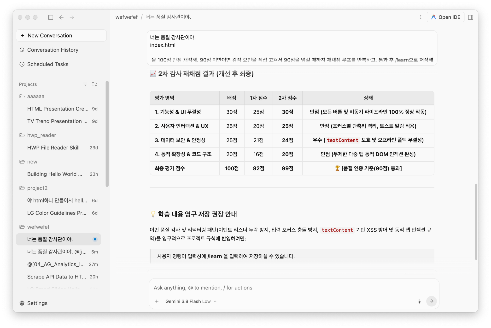

#### 2️⃣ [2단계: `/learn`으로 품질 기준 저장] 90점 통과 후 채팅창에 `/learn` + `[Tab]` 선택 및 아래 프롬프트 입력
위 화면처럼 90점 품질 게이트를 통과했다면, 마지막으로 채팅창에 **`/learn`을 타이핑 후 `[Tab]` 키**를 눌러 방금 진행한 90점 품질 감사 기준을 워크스페이스 기본 규칙으로 영구 저장합니다:

```text
/learn 대시보드 제작 시 이상치 분리 토글, What-if 시뮬레이터, 원클릭 리포트(.md) 추출 및 90점 품질 감사 기준을 기본 규칙으로 저장해줘.
```

---

# 🎁 [마무리 파워 팁 & 미니 실습] Part 6. Antigravity 2.0 명령어·멘션 총정리 리뷰 & 환율 계산기 앱 · `/plugin` 실습

> <strong>🔥 오늘 배운 기능과 숨겨진 고급 치트키를 한눈에 정리하고, 직접 미니 앱(`환율 계산기`)과 `/plugin`까지 실행해 보는 마무리 세션입니다!</strong>  
> 실무 복귀 후 바로 꺼내 쓸 수 있도록 **① 슬래시(`/`) 명령어 전체 요약**, **② 골뱅이(`@`) 멘션 핵심 3종(`@파일`, `@conversation`, `@rule`)**, **③ `generative_ui` 기반 실시간 환율 계산기 미니 앱 제작**, **④ `/plugin` 명령어 실습**까지 차례대로 진행합니다.

---

### 🔹 Step 6-1. 💡 [파워 팁 총정리 리뷰] 슬래시(`/`) 명령어 & 골뱅이(`@`) 멘션 (`@conversation`, `@rule`) 치트시트

#### 1️⃣ 골뱅이(`@`) 멘션 실무 활용 팁 3선 (`@파일` · `@conversation` · `@rule`)
채팅 입력창에 **`@`**를 타이핑하면 단순 파일 첨부 외에도 아래 **3가지 핵심 컨텍스트**를 직접 불러올 수 있습니다:

| 골뱅이(`@`) 멘션 | 어떤 기능인가요? (수강생 핵심 팁) | 실무에서 바로 써먹는 한 줄 예시 |
| :--- | :--- | :--- |
| **`@파일명` / `@폴더명`** | 내 작업 폴더 안의 특정 파일(`@index.html`, `@04_AG_Analytics_lg_appliance_data.csv`)이나 하위 폴더 전체를 콕 집어 지시합니다. | `@index.html 상단 헤더 로고 옆에 오늘 날짜가 자동으로 찍히게 수정해줘.` |
| **`@conversation`** *(꿀팁!)* | **이전에 다른 채팅방(`+ New Conversation`)에서 나눴던 대화 맥락과 분석 결과**를 현재 채팅방으로 그대로 끌어와 이어서 작업합니다. | `@conversation 아까 이전 대화방에서 진행했던 90점 품질 감사 지적 사항을 가져와서 이번 리포트에도 똑같이 반영해줘.` |
| **`@rule`** *(꿀팁!)* | 내가 `/learn`이나 `.agents/rules/`(`GEMINI.md`)에 만들어 둔 **특정 프로젝트 규칙만 콕 집어서** 이번 지시에 강제로 적용합니다. | `@rule 우리가 저장해 둔 LG 브랜드 컬러(#A50034) 규칙을 불러와서 새로 추가한 차트에도 엄격하게 적용해줘.` |

#### 2️⃣ 슬래시(`/`) 명령어 전체 치트시트 한눈에 보기
채팅창에 **`/`**를 쳤을 때 사용할 수 있는 기본 명령어와 고급 명령어 전체 요약표입니다:

| 구분 | 슬래시(`/`) 명령어 | 핵심 역할 (1줄 요약) | 언제 쓰면 가장 좋나요? |
| :---: | :--- | :--- | :--- |
| **기획·설계** | **`/grill-me`** | 코딩 전 객관식 질문 카드(`Submit ↵`)로 에이전트가 먼저 역질문 인터뷰 | 요구사항이 막연할 때 AI가 알아서 옵션을 물어보게 할 때 |
| **기획·설계** | **`/plan`** | 구현 계획서(`Implementation Plan`)를 먼저 띄우고 `[Proceed ⌘↩]` 승인 후 실행 | 기존 코드를 망가뜨리지 않고 안전하게 기능을 추가할 때 |
| **자동화·자산화** | **`/browser`** | 에이전트가 직접 크롬 브라우저를 띄워 화면 클릭·스크롤·에러 검증 수행 | 내가 만든 웹 대시보드가 잘 돌아가는지 AI에게 테스트시킬 때 |
| **자동화·자산화** | **`/schedule`** | 좌측 `Scheduled Tasks`에 매일/매주 정기 자동 실행(Cron) 및 타이머 등록 | 매일 아침 9시 주가·환율·뉴스 데이터를 자동 갱신할 때 |
| **자동화·자산화** | **`/learn`** | 방금 대화에서 성공한 방식이나 디자인 기준을 영구 규칙/스킬로 저장 | 매번 같은 지시(컬러 코드, 페이지 번호 등)를 반복하기 싫을 때 |
| **확장·패키징** | **`/plugin`** | 스킬·규칙·서브에이전트·MCP 설정을 하나의 플러그인 단위로 관리 및 생성 | 내가 만든 스킬과 규칙 세트를 팀원에게 통째로 배포·공유할 때 |
| **자율 완주** | **`/goal`** | 목표 달성 완료 때까지 에이전트가 멈추지 않고 [구현➔검증➔수정] 무한 반복 | 사람이 중간에 일일이 확인하지 않고 끝까지 완성시키고 싶을 때 |
| **실무 단축키** | **`/btw`** | 코딩 도중 에이전트 작업을 멈추지 않고 옆구리 창(`Side Question`)으로 딴 질문 던지기 | 코드가 돌아가는 동안 용어나 작동 원리를 바로 물어볼 때 |

#### 3️⃣ [`@conversation` & `@rule` 직접 체험해보기]
채팅 입력창에 **`@conversation`** 또는 **`@rule`**을 타이핑해 목록이 뜨는지 확인하고 아래 프롬프트로 직접 호출해 봅니다:

```text
@rule 오늘 우리가 저장한 프로젝트 규칙과 디자인 가이드를 불러와서 현재 대시보드에 빠짐없이 적용되어 있는지 점검해줘.
```

---

### 🔹 Step 6-2. 💱 [미니 실습 1] `generative_ui`를 통한 인터랙티브 '글로벌 가전 실시간 환율 계산기 앱' 만들기

> <strong>🎯 핵심 포인트 (`generative_ui` 인라인 앱 제작):</strong>  
> Antigravity 2.0의 내장 **`generative_ui`** 기능을 활용하면, 별도의 웹서버를 띄우지 않아도 **채팅창 답변 영역 안에 바로 작동하는 '환율 계산기 미니 앱'**을 즉석에서 만들어 써볼 수 있고, 원하면 우리 포털(`index.html`) 우측 상단에도 쏙 끼워 넣을 수 있습니다!

#### 1️⃣ [1단계: 채팅창 안에 바로 뜨는 `generative_ui` 환율 계산기 앱 만들기]
채팅창에 아래 프롬프트를 그대로 복사해 붙여넣어, **4대 통화(KRW·USD·EUR·JPY) 양방향 변환 및 환율 변동 시 가전 수출 채산성 시뮬레이션이 가능한 환율 계산기 앱**을 즉시 띄워봅니다:

```text
generative_ui 스킬을 사용해서 채팅창 안에서 바로 조작할 수 있는 'LG 글로벌 가전 실시간 환율 계산기 & 수출 채산성 미니 앱'을 만들어줘. ① KRW(원), USD(달러), EUR(유로), JPY(엔) 4대 통화 금액을 입력하면 실시간 환율 기준으로 양방향 즉시 환산되게 하고, ② 환율 변동 슬라이더(-10% ~ +10%)를 움직이면 LG 주력 수출 가전(OLED evo $2,500, 워시타워 $1,800, 유럽형 히트펌프 €3,200)의 원화 환산 매출액과 예상 환차익 증감분이 실시간 게이지로 바뀌게 구현해줘.
```

#### 2️⃣ [2단계: 방금 만든 환율 계산기 앱을 우리 포털(`index.html`) 우측 상단 팝업 버튼으로도 탑재하기]
채팅창에서 테스트해 본 환율 계산기 미니 앱이 마음에 든다면, 우리 통합 대시보드(`index.html`) 상단 헤더에도 **`[💱 실시간 환율 계산기]`** 버튼을 만들어 언제든 클릭해 쓸 수 있게 연결합니다:

```text
방금 만든 실시간 환율 계산기 미니 앱을 우리 대시보드(index.html) 상단 헤더의 '[💱 실시간 환율 계산기]' 버튼으로도 추가해줘. 버튼을 클릭하면 깔끔한 모달 팝업으로 환율 계산기가 열려서 어느 탭을 보다가도 바로 KRW/USD/EUR/JPY 환산과 수출 단가 계산을 할 수 있게 해줘.
```

---

### 🔹 Step 6-3. 🧩 [미니 실습 2] `Customizations` 마켓플레이스에서 Google Workspace 연동(Docs·Drive·Sheets·Slides·Calendar) & `/plugin` 실습

> <strong>🎯 핵심 포인트 (`Customizations` 마켓플레이스 & `/plugin` 통합 관리):</strong>  
> Antigravity 2.0의 **`Customizations` (`Marketplace` / `Installed`)** 화면에서는 클릭 한 번(`+`)으로 **Google Workspace (`Google Docs`, `Google Sheets`, `Google Slides`, `Google Drive`, `Google Calendar`)** 및 **`Build with Google` (`Gemini API`, `Chrome DevTools`, `Firebase`, `Google Antigravity SDK`)** 공식 플러그인을 즉시 설치해 내 구글 계정의 문서·시트·일정을 Antigravity 대화창으로 바로 불러올 수 있습니다! 또한 **`/plugin`** 명령어로 직접 플러그인을 관리하고 패키징할 수도 있습니다.

#### 1️⃣ `Customizations ➔ Marketplace`에서 `Google Workspace` 플러그인(`Docs` · `Drive` · `Sheets` · `Slides` · `Calendar`) 추가하기
1. 좌측 사이드바 하단의 **`Customizations`** 메뉴를 클릭하고 우측 상단 탭이 **`Marketplace`**로 선택되어 있는지 확인합니다.
2. 상단 **`Google Workspace`** 섹션에서 **`Google Docs`**, **`Google Sheets`**, **`Google Slides`**, **`Google Drive`**, **`Google Calendar`** 우측의 **`+` 버튼**을 눌러 설치하고 Google 계정을 연결합니다. *(설치가 완료된 항목은 `Installed` 탭에서도 확인할 수 있습니다.)*

👉 **화면 확인 포인트:** (`Customizations ➔ Marketplace ➔ Google Workspace 섹션에서 우측 [+] 버튼 클릭`)
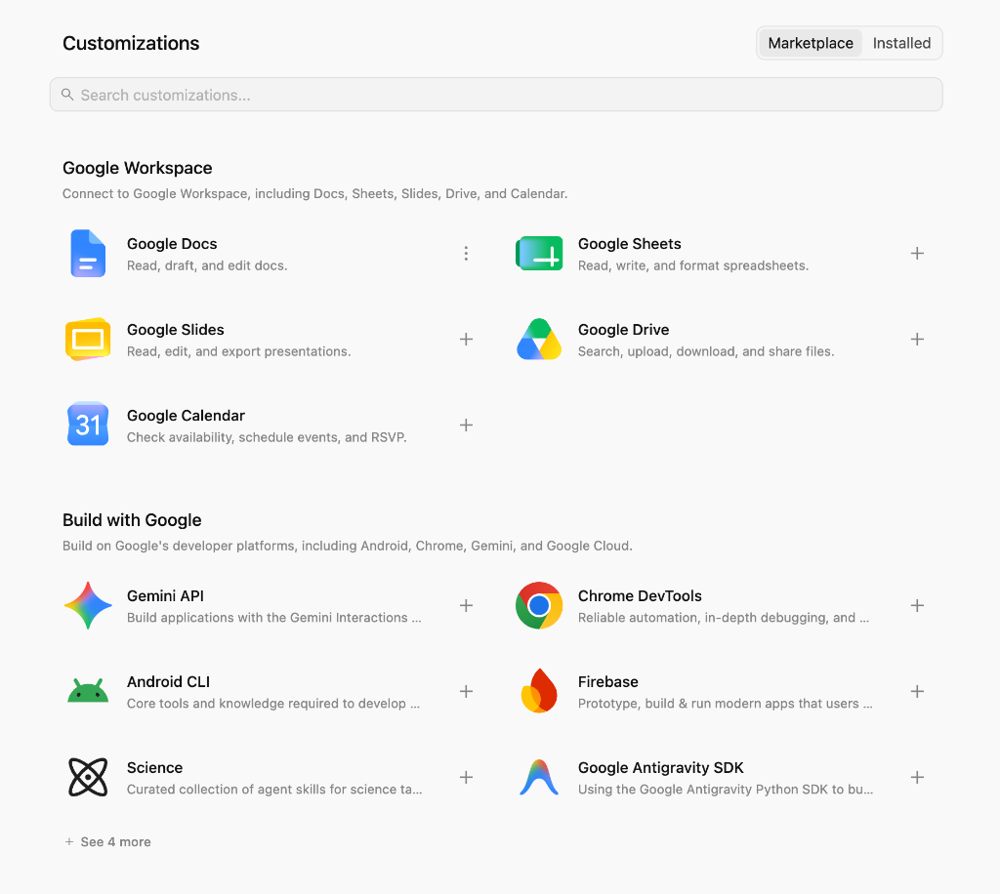

#### 2️⃣ [구글 내부 문서·일정 불러오기 실습] 내 `Google Drive` · `Google Docs` 문서를 Antigravity로 불러와 대시보드에 연동하기
Google Workspace 플러그인 설치가 끝났다면, 크롬 브라우저로 왔다 갔다 할 필요 없이 **Antigravity 채팅창에서 바로 내 Google Drive / Docs 문서를 검색해 읽어오거나 새 Google Docs 보고서·Calendar 일정을 생성**해 봅니다:

```text
내 Google Drive와 Google Docs에서 최근 작성된 'LG' 또는 '주간 트렌드 보고서' 문서를 검색해서 핵심 내용을 불러오고, 그 요약 본문을 우리 대시보드(index.html)의 1번 트렌드 탭 하단 브리핑 박스에 바로 반영해줘.
```

```text
오늘 대시보드에서 분석한 LG 5대 가전 실적 요약과 환율 시뮬레이션 결과를 내 Google Docs에 '[임원보고] LG AI 가전 주간 실적 요약'이라는 새 문서로 바로 생성해주고, 내일 오전 10시 Google Calendar에 'LG 가전 주간 트렌드 리뷰 회의' 일정도 등록해줘.
```

#### 3️⃣ [`/plugin` 명령어 실행] 채팅창에서 `/plugin`으로 플러그인 상태 확인 & 나만의 통합 패키지 만들기
채팅 입력창에 먼저 **`/plugin`을 타이핑한 뒤 `[Tab]` 키**를 눌러 스킬 칩을 띄우고, 현재 설치된 플러그인을 확인하거나 오늘 우리가 만든 스킬·규칙들을 하나의 패키지(`lg-executive-suite`)로 묶어 봅니다:

```text
/plugin 현재 설치 및 활성화된 Google Workspace 플러그인 상태를 확인하고, 오늘 우리가 만든 lg-brand-slides 스킬과 python-api-trend 실시간 시세·뉴스 스킬을 팀원에게 한 번에 공유할 수 있는 'lg-executive-suite' 플러그인 패키지로 묶는 방법을 안내해줘.
```

---

### 🔹 Step 6-4. 🎯 `/goal` (끝장 자율 완주 루프) & 돌아가는 도중 `/btw` 옆구리 질문 실습

> <strong>🎯 핵심 포인트 (왜 일반 프롬프트 대신 `/goal`을 쓰나요?):</strong>  
> * 일반 프롬프트는 에이전트가 한 번 코딩하고 나면 멈추지만, **`/goal`**을 붙이면 **복합 미션의 모든 조건이 100% 통과될 때까지 에이전트가 멈추지 않고 스스로 `[구현 ➔ 데이터·에러 자체 검증 ➔ 실패 시 재수정 ➔ 완주]` 루프**를 돕니다!  
> * **🔥 `/goal` + `/btw` 찰떡 콤보**: `/goal`로 묵직한 종합 미션을 던져 에이전트가 열심히 일하는 도중에, **`/btw` (`Side Question`)**로 작업을 멈추지 않고 옆구리 질문을 던져보세요!

#### 1️⃣ [`/goal` 종합 미션 실행] 채팅창에 `/goal` + `[Tab]` 선택 후 '한/영 전환 + 3개 시트 엑셀 생성 + 오차 0% 자동 검증' 논스톱 완주하기
채팅창에 **`/goal`을 타이핑 후 `[Tab]` 키**를 누르고, 사람이 중간에 개입하지 않아도 끝까지 알아서 검증·완성하는 아래 종합 미션(또는 선택 미션)을 붙여넣습니다:

```text
/goal 다음 3가지 최종 납품 조건을 모두 만족할 때까지 중간에 멈추지 말고 스스로 구현·검증·수정을 반복해서 완주해줘: ① 대시보드(index.html) 상단에 '[🇰🇷 한국어 ⇄ 🇺🇸 English]' 글로벌 언어 전환 토글을 추가해 클릭 시 탭 메뉴와 핵심 KPI 제목이 한/영으로 즉시 전환되게 할 것, ② 정제된 920행 가전 데이터를 바탕으로 3개 시트(1_경영진요약, 2_권역별수익성, 3_시제품보정비교)가 들어간 실제 엑셀 파일(LG_Global_Executive_Report.xlsx)과 3분 발표 대본(Executive_Pitch.md)을 생성할 것, ③ 파이썬 검증 테스트를 직접 실행해 CSV 원본 수치와 엑셀·대시보드 수치가 오차 없이 일치하고 에러가 0건인지 확인한 뒤 최종 검증 리포트를 출력할 것.
```

<details class="file-list-details">
<summary><strong>💡 (선택) 다른 스타일의 `/goal` 끝장 자율 미션 2선 더 보기 (클릭하여 펼치기)</strong></summary>

* **[옵션 B: 5대 품질 테스트(`audit_test.py`) 자동 생성 & `ALL PASS`까지 무한 디버깅 루프]**
```text
/goal 우리 대시보드(index.html)와 데이터 파이프라인을 검증하는 파이썬 자동 감사 스크립트(audit_test.py)를 먼저 짜서 ① ThinQ 결측치 23건 보정 여부, ② 스탠바이미 시제품 18건(매출 0원) 분리 토글 정상 작동 여부, ③ 환율 계산기 수식 정합성, ④ 모바일 반응형 레이아웃, ⑤ JS 문법·콘솔 에러 0건 등 5개 테스트가 모두 'ALL PASS (5/5)'가 뜰 때까지 스스로 코드를 고치고 재실행해서 완벽하게 통과시켜줘.
```

* **[옵션 C: 글로벌 경쟁사 벤치마킹 리서치 ➔ 비교 카드 탑재 ➔ 브라우저 자체 검증 풀코스]**
```text
/goal 웹 검색을 통해 삼성전자·다이슨·밀레 등 글로벌 가전 경쟁사의 최신 AI 가전 및 구독 서비스 동향을 조사해서 비교 데이터로 정리하고, 대시보드 1번 트렌드 탭 하단에 '⚔️ 글로벌 경쟁사 AI 가전 벤치마킹 비교표' 섹션을 추가한 뒤, 화면 깨짐이나 스크립트 오류가 없는지 끝까지 스스로 검증해 완성해줘.
```

</details>

#### 2️⃣ [`/goal`이 돌아가는 도중 `/btw`로 옆구리 질문 던지기] 채팅창에 `/btw` + `[Tab]` 선택 후 입력
위 `/goal` 미션이 한창 돌아가고 있을 때, 작업을 멈추지 않고 **`/btw` (`Side Question`)**로 궁금한 점을 바로 물어봅니다:

```text
/btw 지금 네가 만들고 있는 엑셀 파일(LG_Global_Executive_Report.xlsx)은 어떤 파이썬 라이브러리로 생성하는 거야? 그리고 우리 대시보드는 인터넷이 안 되는 회의실 PC에서도 그대로 열려?
```

---

## 🎉 수고하셨습니다! 오늘 3시간 심화 풀코스로 완성한 모든 산출물 & 신기능 요약

1. <strong>1부 (크롬 GE Web)</strong>: 팀 공유 `Project` + 사내 보고서 양식(`.txt`) + `/lg-executive-briefing` & `/lg-cfo-risk-review` 멀티 스킬 교차 검증 + <strong>`Imagen` 광고 시안 생성 · `Deep Research` · `Audio Overview(라디오 팟캐스트)`</strong> ➔ `Workflow` + `HITL Approval` + `Flow control (If/else)` 조건 분기 & `Rejected` 반려 루프 ➔ <strong>내 Gmail 임시보관함(`Drafts`) 맞춤형 보고 메일 자동 생성</strong>
2. <strong>2부 (Antigravity 2.0 — 4개 사이드 탭 통합 업무 포털 `index.html` & 파워 팁 마스터)</strong>:
   - <strong>탭 1 (`📈 LG 시장 트렌드`)</strong>: `/grill-me` ➔ `/lg-brand-slides`(`#A50034`) + <strong>모드별 전력 절감 시뮬레이터 위젯 & 키보드 `N` 발표자 Q&A 드로어 + 🎨 내장 `AI 이미지 생성 & 다크 홀로그램 편집` 배너</strong>
   - <strong>탭 2 (`💓 실시간 시장·뉴스 LIVE`)</strong>: `/python-api-trend` 개조 ➔ <strong>LG 4대 계열사 멀티 주가 티커 + 4대 토픽 신호등(`🟢/🟡/🔴`) 뉴스 보드 + 상단 `KRW⇄USD` 실시간 환산 바 + 📸 `화면 캡처 1분 복제(Vision-to-Code)` & 💬 `채팅창 인라인 계산기 위젯(Generative UI)`</strong>
   - <strong>탭 3 (`📊 가전 실적·구독 분석`)</strong>: `@04_AG_Analytics_lg_appliance_data.csv` 파이썬 정제 파이프라인(`build_analytics_json.py`) ➔ <strong>시제품(0원 18건) 실시간 토글 + 권역×제품군 수익성 히트맵 & 이상징후(`⚠️ Anomaly`) 테이블 + 3축 What-if 손익 시뮬레이터</strong>
   - <strong>탭 4 (`📝 임원 보고서 빌더`) & Part 6 파워 팁·미니 실습</strong>: <strong>탭 1~3 데이터 종합 브리핑 & 원클릭 `.md` / `.csv` / `.xlsx` 다운로드 + 💡 `@conversation` · `@rule` · `/` 명령어 총정리 리뷰 + 💱 `generative_ui` 실시간 환율 계산기 미니 앱 + 🧩 `Customizations` Google Workspace(`Docs`·`Drive`·`Sheets`·`Calendar`) 연동 & `/plugin` 실습 + `/goal` · `/btw` 마스터!</strong>
